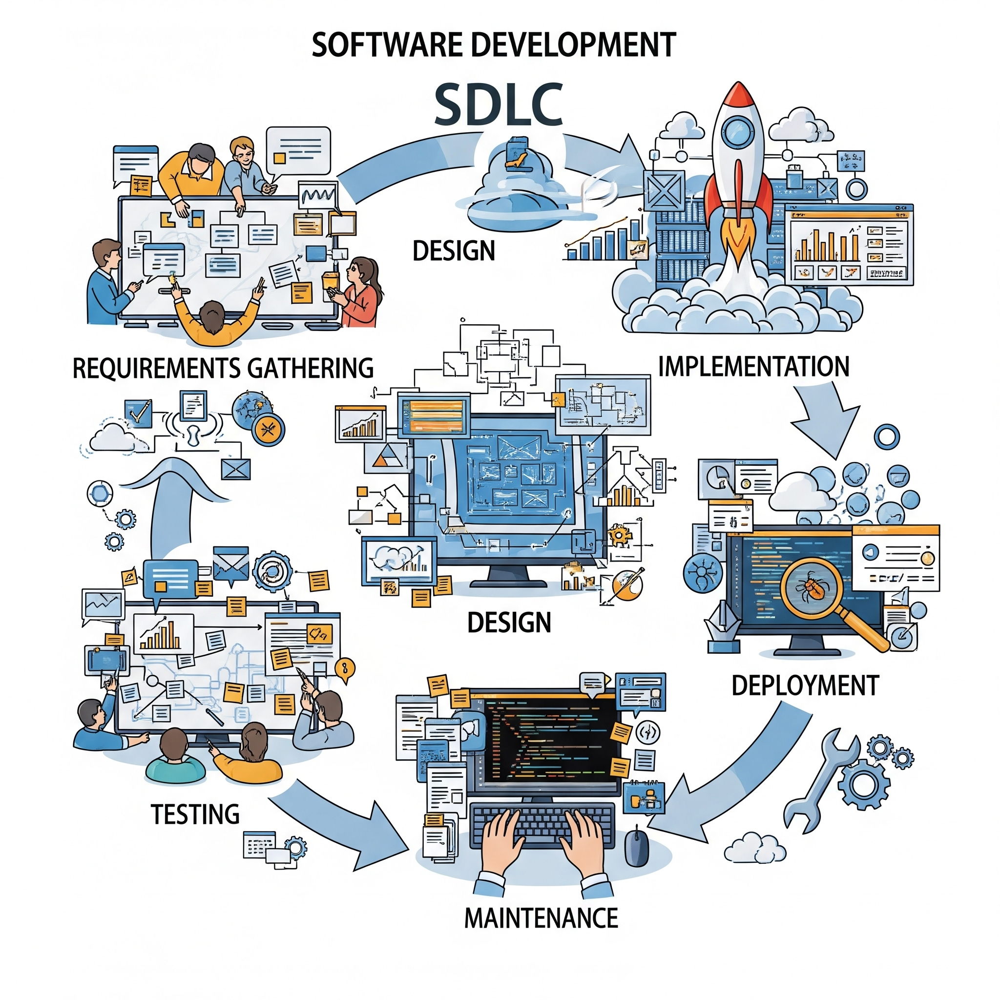
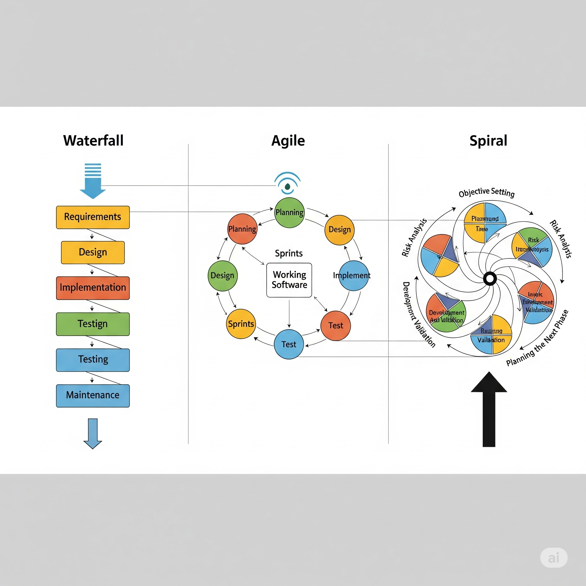

# 📘 Introduction to Software Engineering by IBM – Coursera  
## 🧩 Module 1: The Software Development Lifecycle (SDLC)

---

### 🔍 Overview of SDLC

The **Software Development Lifecycle (SDLC)** is a structured framework that outlines the various stages involved in the development of software. It provides a step-by-step approach to planning, creating, testing, deploying, and maintaining software applications. This framework ensures that software is developed systematically and meets customer expectations.

---

### 🛠️ Phases of SDLC

1. **Requirements Gathering**  
   Identify and document the goals, features, and constraints of the software.

2. **Design**  
   Define the architecture, system components, user interfaces, and data models.

3. **Implementation**  
   Write the actual code to create the software based on the design specifications.

4. **Testing**  
   Verify that the software works as intended. Detect and fix bugs.

5. **Deployment**  
   Release the software to the end-users.

6. **Maintenance**  
   Provide ongoing updates and fixes post-deployment.

---

### 🎯 Importance of SDLC

Using a structured SDLC process:

- Ensures **high-quality** software.
- Improves **efficiency** and **project planning**.
- Minimizes **risks** and unexpected issues.
- Enhances **team collaboration**.
- Supports **on-time** and **within-budget** delivery.

---

### 🔄 Models of SDLC

1. **Waterfall Model**  
   A linear, sequential model. Suitable for projects with fixed, well-understood requirements.

2. **Agile Model**  
   An iterative model focused on collaboration, flexibility, and customer feedback.

3. **Spiral Model**  
   Combines iterative development with risk analysis. Best for large and high-risk projects.

---

### 🧠 Summary

Module 1 introduces the concept of SDLC, explains its phases and models, and emphasizes its importance in modern software development.

---

> _This summary was prepared by Dheraj_k based on interaction with AI assistance and content from IBM’s Coursera course._
