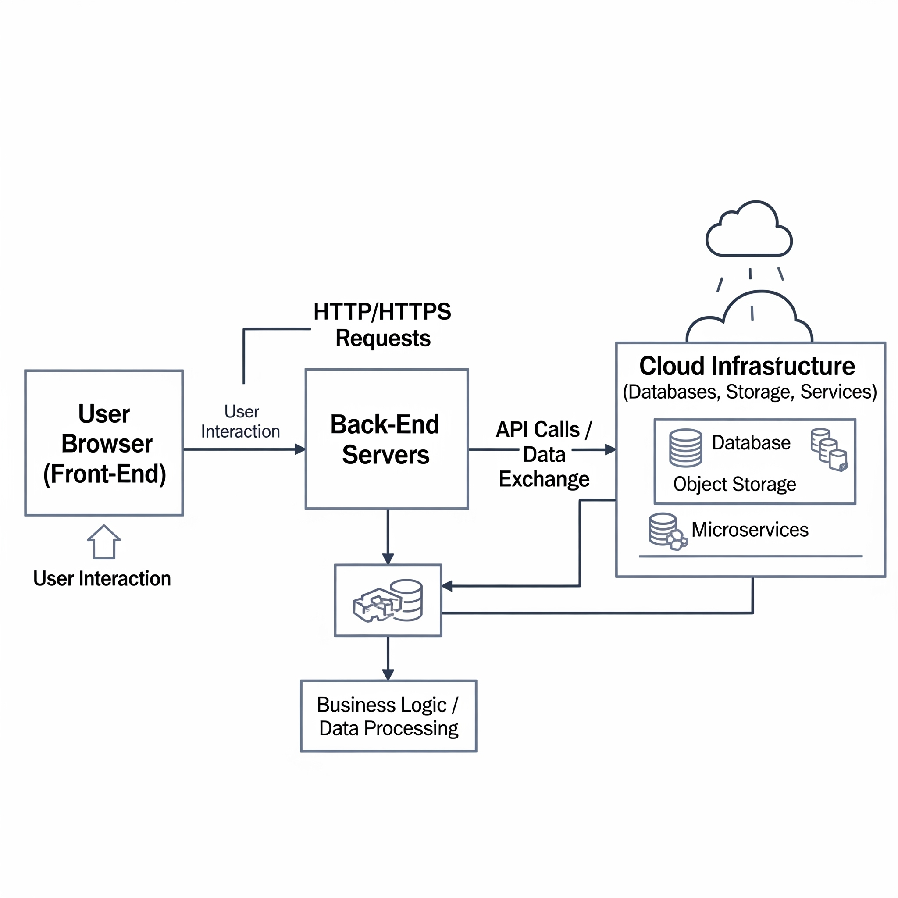
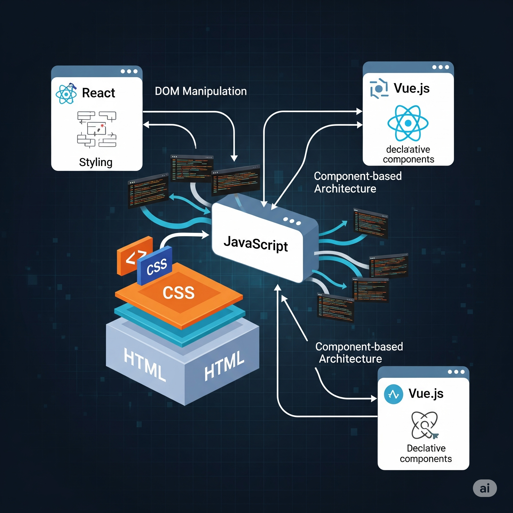
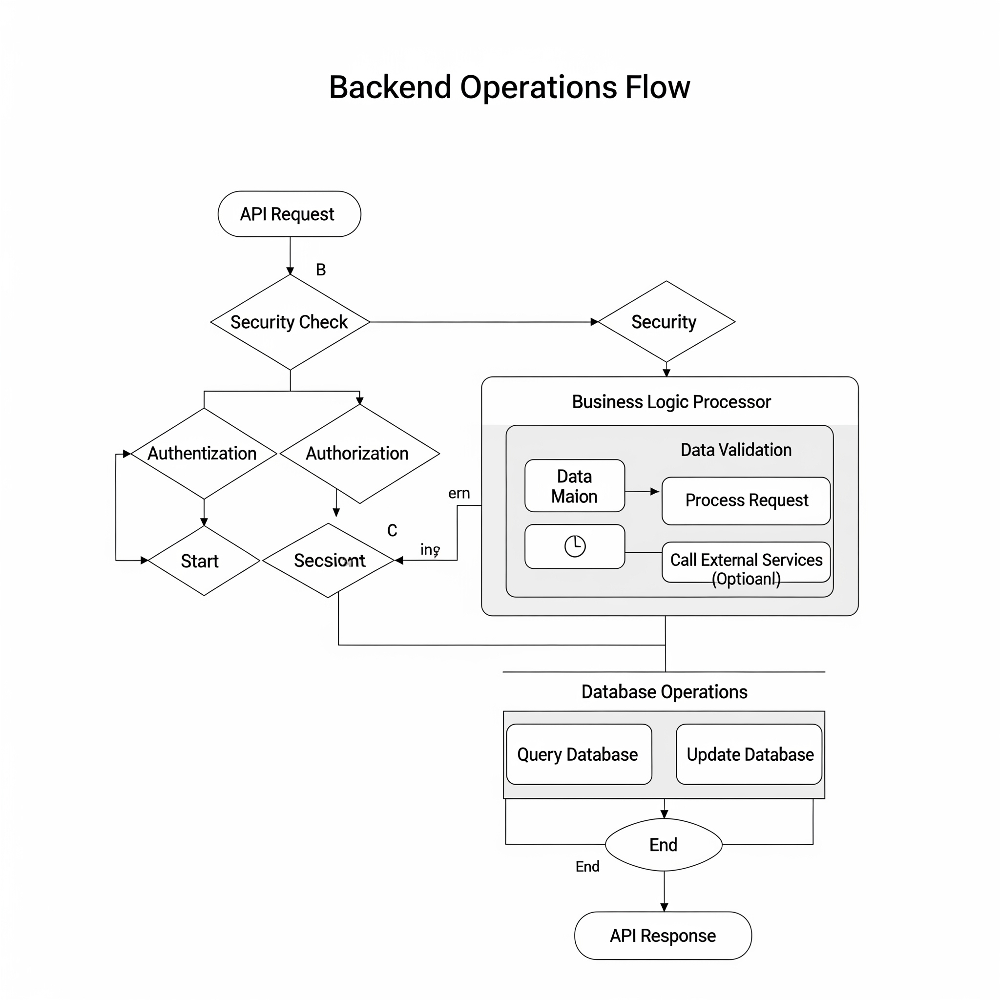
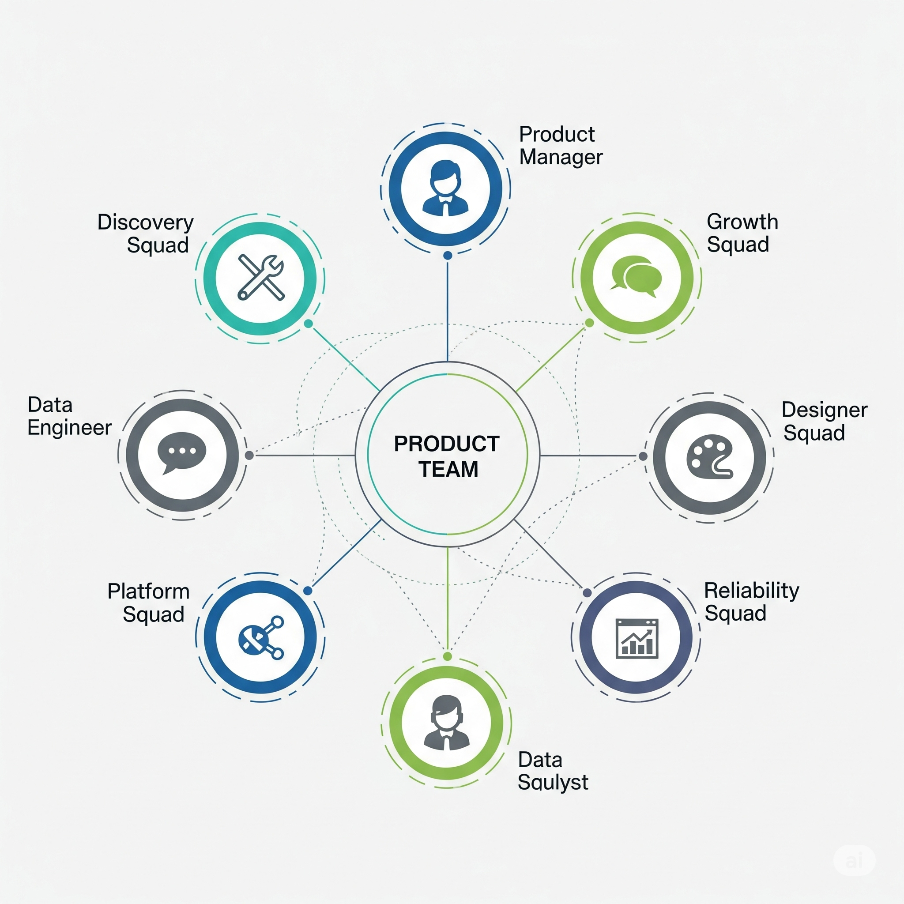
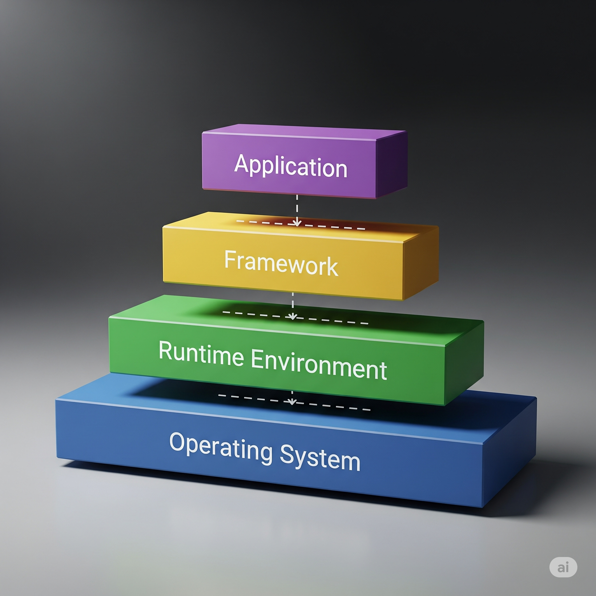

# 📘 Introduction to Software Engineering by IBM – Coursera  
## 🧩 Module 2: Web & Cloud Development, Teamwork & Tools

---

### Key Learnings

- **Software Development Process:**  
  The process includes planning, designing, coding, testing, deploying, and maintaining software — all necessary steps to build reliable applications.

- **Development Methodologies:**  
  - **Agile:** Focuses on iterative development and adapting to changes quickly.  
  - **Waterfall:** A linear, step-by-step approach where each phase completes before the next begins.

- **Tools & Technologies:**  
  Tools like IDEs, programming languages, frameworks, and libraries enable developers to write and manage code efficiently.

- **Coding & Collaboration Best Practices:**  
  Emphasizes writing clean, reusable code, following coding standards, and using communication tools to collaborate effectively.

- **Version Control Systems:**  
  Systems such as Git help developers track changes, manage versions, and collaborate seamlessly.

---

### Module Topics & Explanations

1. **Overview of Web and Cloud Development**  
   Websites and applications run by connecting user interfaces (front-end) with servers (back-end) often hosted in the cloud. This allows scalable, on-demand services accessible via browsers or apps.  
   

2. **Learning Front-End Development**  
   Front-end development focuses on building what users see and interact with — the layout, styling, and behavior of websites using technologies like HTML, CSS, and JavaScript frameworks (React, Angular, Vue).  
   

3. **The Importance of Back-End Development**  
   Back-end handles the core logic, data storage, security, and communication with front-end. It ensures that requests from users are processed correctly and securely. Technologies here include databases, server-side languages, and APIs.  
   

4. **Teamwork and Squads**  
   Software projects often use cross-functional teams called squads. These squads include developers, testers, and product owners who collaborate closely to deliver features efficiently.  
   

5. **Insiders' Viewpoint: Teamwork in Software Engineering**  
   Real-world insights highlight the importance of communication, trust, and shared goals for team success.

6. **Pair Programming**  
   Two developers work together at one workstation, reviewing and writing code collaboratively. This practice improves code quality, knowledge sharing, and reduces bugs.  
   

7. **Insiders' Viewpoint: Pair Programming**  
   Experienced developers share how pair programming fosters learning and faster problem-solving.

8. **Activity: Categorizing Front- and Back-End Technologies**  
   A hands-on exercise to identify which tools and languages belong to front-end or back-end development.

9. **Introduction to Development Tools**  
   Developers use various tools including IDEs, debuggers, build tools, and version control to streamline development and deployment.

10. **Introduction to Software Stacks**  
    A software stack is a combination of technologies used together to build applications, including the operating system, database, runtime, and frameworks.  
    

11. **Insiders' Viewpoint: Tools and Technologies**  
    Insights from professionals on choosing and using the right tools to maximize productivity.

---

### Summary

Congratulations on completing Module 2!

You now understand:

- How web and cloud technologies connect front-end user interfaces with back-end servers.  
- The roles and technologies of front-end and back-end development.  
- The benefits of effective teamwork and pair programming in software projects.  
- How developer tools and version control support efficient collaboration and code management.  
- The concept and importance of software stacks in application development.

---

> 🧠 Prepared by **Dheraj_K**  
> IBM – Introduction to Software Engineering (Coursera)  
> Module 2: Web & Cloud Development, Teamwork & Tools
