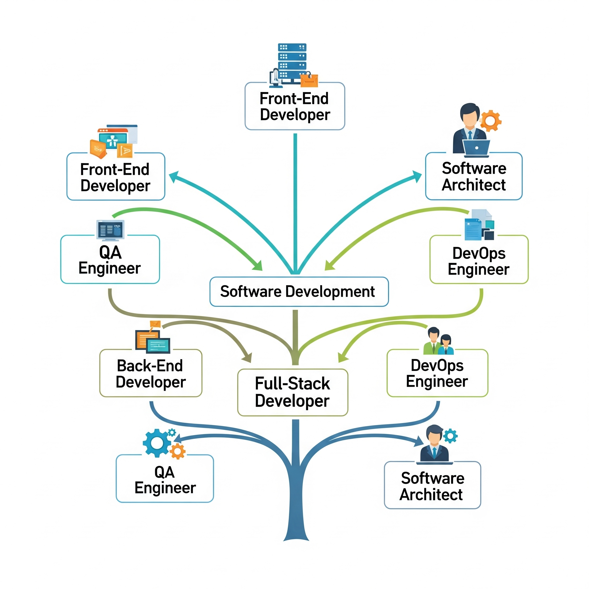
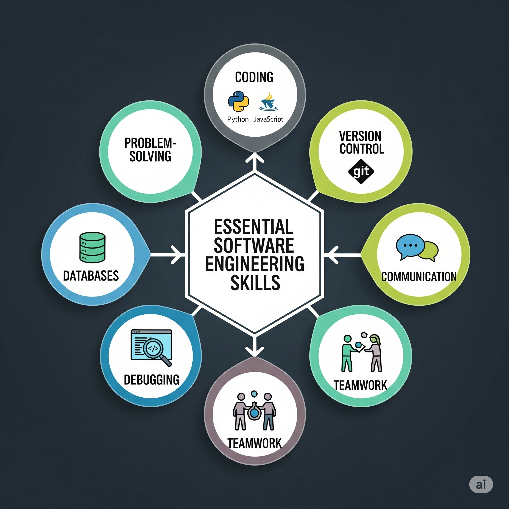
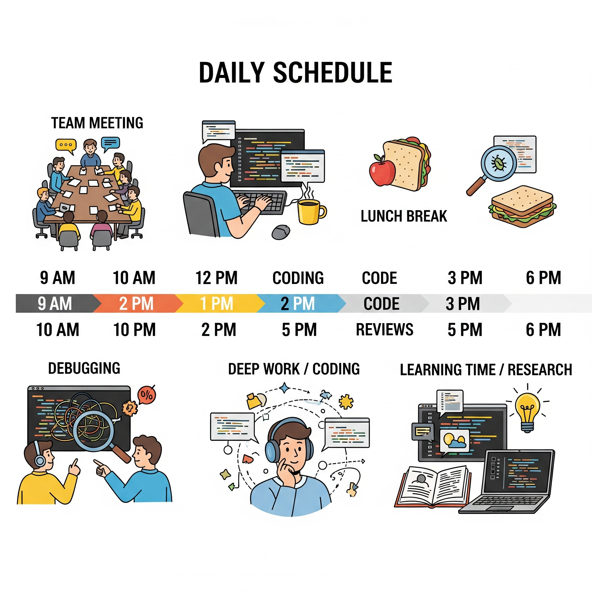
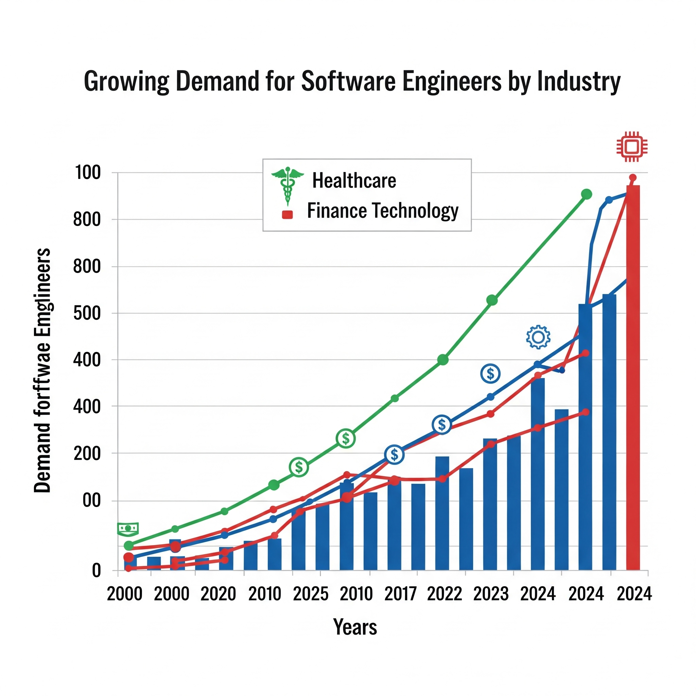
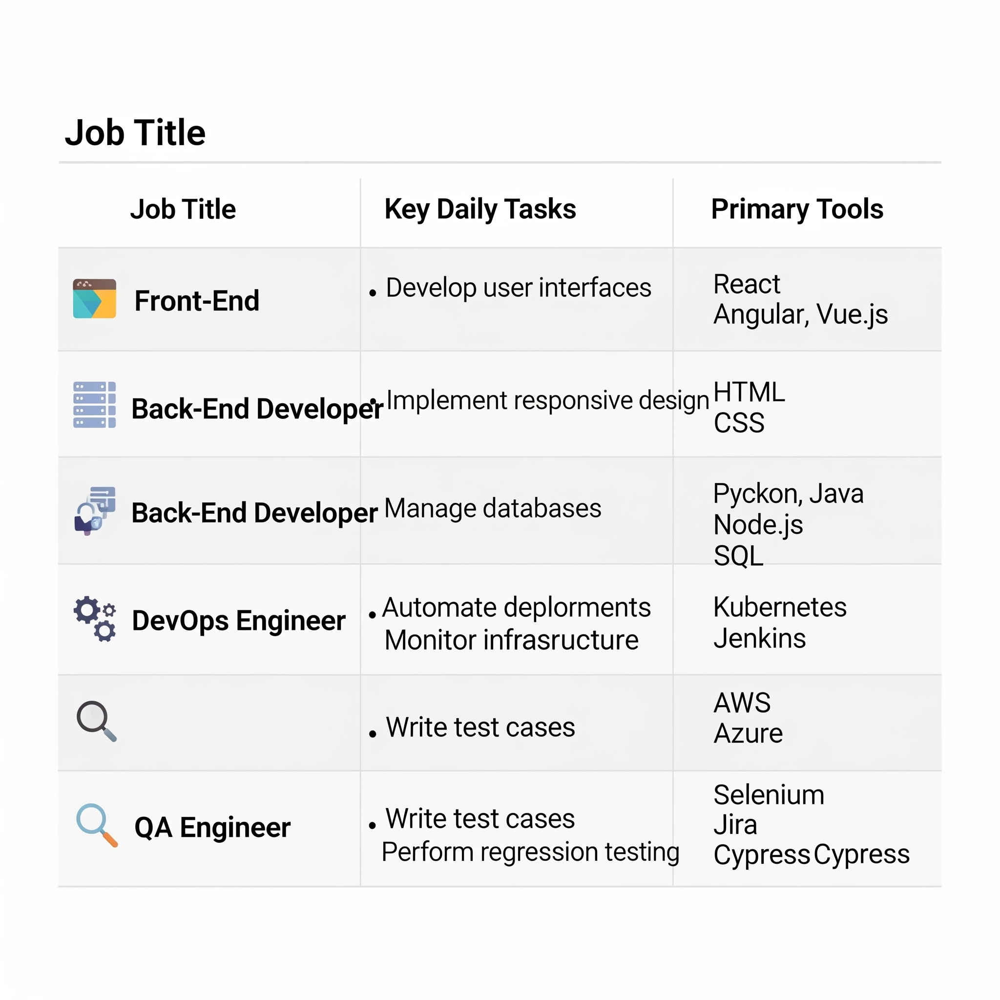

# 📘 Introduction to Software Engineering – IBM (Coursera)  
## 🧩 Module 5: Job Opportunities and Skillsets in Software Engineering

---

### 🧭 Overview

This module provides a comprehensive look at the **career paths**, **skills**, and **industry demands** in software engineering. It helps learners understand what it takes to become a software engineer, the roles available, and how to grow in the field.

---

### 💼 Career Paths in Software Engineering

Software engineers can specialize in a wide range of roles based on their interests and skills. Common paths include:

- **Front-End Developer** – focuses on user interfaces and experiences  
- **Back-End Developer** – handles server-side logic and databases  
- **Full-Stack Developer** – skilled in both front-end and back-end  
- **DevOps Engineer** – bridges the gap between development and operations  

---

### 🧠 Skills Required for Software Engineering

Successful software engineers possess a blend of hard and soft skills:

- Proficiency in programming languages  
- Understanding of data structures and algorithms  
- Knowledge of development methodologies (Agile, Scrum, etc.)  
- Familiarity with tools like Git, Docker, CI/CD pipelines  
- Communication, teamwork, and problem-solving skills  

---

### 🛠️ A Day in the Life of a Software Engineer

A typical day includes:

- Writing and reviewing code  
- Attending stand-up or team meetings  
- Debugging, testing, or deploying applications  
- Collaborating with other developers, testers, or designers  

---

### 📊 Job Market Trends

The demand for software engineers continues to rise due to:

- Increased digital transformation  
- The rise of cloud computing and DevOps  
- The importance of automation and scalable infrastructure  

Software roles often come with flexibility, high salaries, and remote opportunities.

---

### 🏷️ Job Titles and Descriptions

Software engineering includes various specialized titles. Each has distinct responsibilities and expectations:

- **Software Developer** – builds and maintains applications  
- **Systems Engineer** – designs and implements system-level solutions  
- **QA Engineer** – focuses on testing and quality assurance  
- **Cloud Engineer** – works with cloud infrastructure and services  
- **Site Reliability Engineer (SRE)** – ensures system reliability and performance  

---

### 📜 Summary

Congratulations! You have completed Module 5.

By now, you should understand:

- The core responsibilities of a software engineer  
- Different job titles and how they vary by skillset and focus  
- The blend of hard and soft skills needed to excel  
- Current trends and future outlook of the tech industry  
- The importance of ethics and continuous learning in this field  

---

> 👤 Prepared by **Dheraj_K**  
> Course: Introduction to Software Engineering (IBM - Coursera)  
> 📁 Module 5: Job Opportunities and Skillsets in Software Engineering
