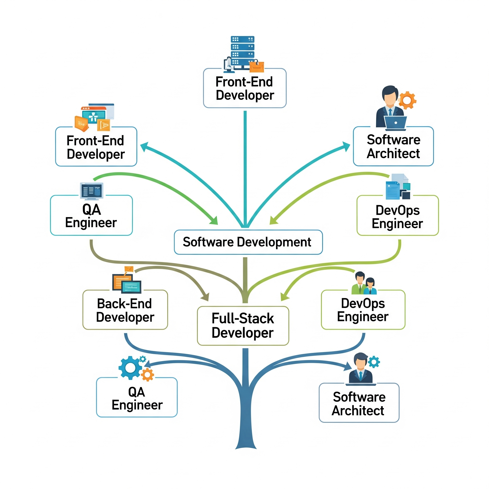
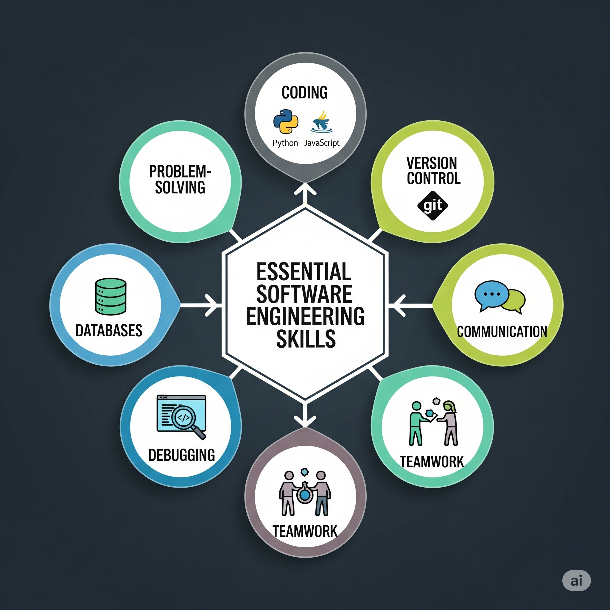
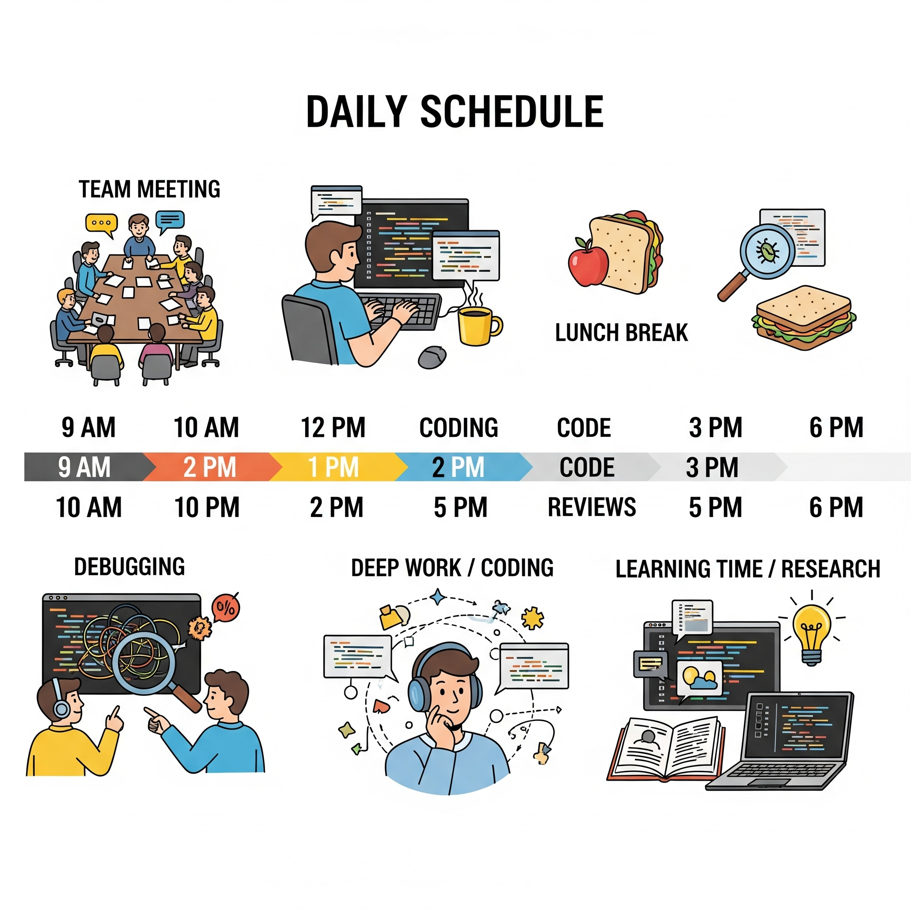
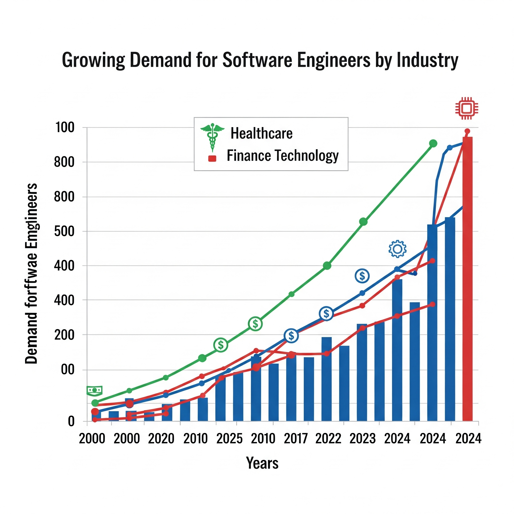

# 💼 Module 5: Job Opportunities and Skillsets in Software Engineering  
*IBM - Introduction to Software Engineering (Coursera)*  

---

## 📘 Overview

This module explores the growing and diverse career opportunities in software engineering. It focuses on essential skills, typical work environments, and job market trends. Whether you're aiming to be a developer, engineer, or technical manager, understanding these roles will help you plan your career path.

---

## 🔹 1. Career Paths in Software Engineering

There are multiple career tracks available in the field of software engineering:

- **Front-End Developer** – Focuses on user interface and experience.
- **Back-End Developer** – Works with server logic, databases, and APIs.
- **Full-Stack Developer** – Manages both front-end and back-end development.
- **DevOps Engineer** – Bridges development and operations with automation tools.
- **QA Engineer, Testers, and Architects** – Work on software quality, scalability, and structure.

---

## 🔹 2. Skills Required for Software Engineering

Software engineers need a combination of hard and soft skills:

- Proficiency in **programming languages** (e.g., Python, Java, JavaScript)
- Understanding of **data structures & algorithms**
- Familiarity with **version control systems** like Git
- Knowledge of **software development methodologies** like Agile/Scrum
- Soft skills: **teamwork**, **problem-solving**, **communication**

---

## 🔹 3. A Day in the Life of a Software Engineer

A typical day might include:

- Writing and reviewing code
- Attending stand-up or sprint planning meetings
- Collaborating with team members on GitHub or project boards
- Testing/debugging and deploying applications

---

## 🔹 4. Job Market Trends

The demand for software engineers is high across all industries, driven by digital transformation. Trends include:

- Remote and hybrid job opportunities
- Growing need for **cloud, cybersecurity, and AI** expertise
- Companies seeking versatile engineers who adapt quickly to tech changes

---

## 🔹 5. Software Engineering Job Titles

Some common job titles:

- Software Engineer
- Front-End/Back-End Developer
- Mobile App Developer
- QA Engineer
- DevOps Engineer
- Technical Lead / Engineering Manager

Each role has distinct responsibilities but shares core technical skills.

---

## 🔹 6. Code of Ethics in Software Engineering

The **Software Engineering Code of Ethics** includes 8 principles:

1. Public  
2. Client and Employer  
3. Product  
4. Judgment  
5. Management  
6. Profession  
7. Colleagues  
8. Self

Ethical practice ensures trust, responsibility, and fairness in development.

---

## ✅ Summary & Key Takeaways

Congratulations! You have completed Module 5. You now understand:

- The **daily responsibilities** and **career tracks** in software engineering  
- The importance of both **technical and soft skills**  
- The variety of **roles and job titles** available in the field  
- The **growing job market demand** for software professionals  
- The significance of adhering to a **professional code of ethics**  

---

> 👨‍💻 Prepared by **Dheraj_K**  
> 📚 *IBM – Introduction to Software Engineering (Coursera)*  
> 📦 Module 5: Job Opportunities and Skillsets in Software Engineering

