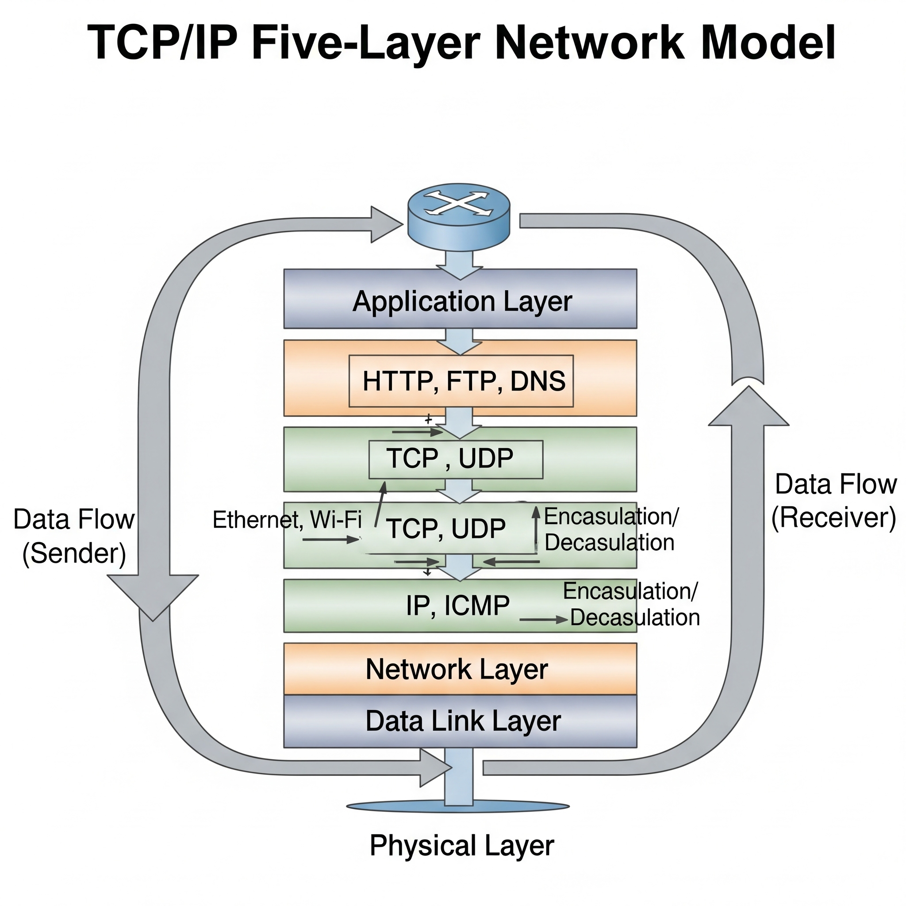
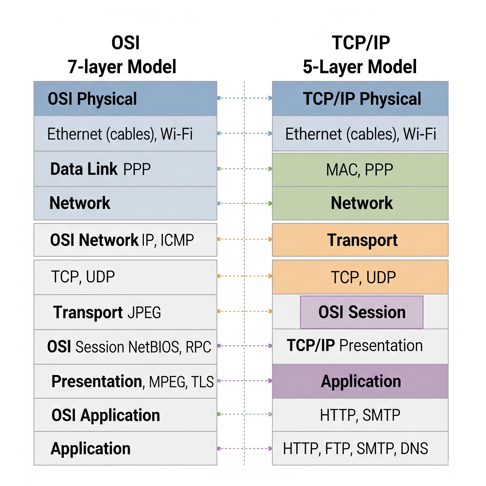
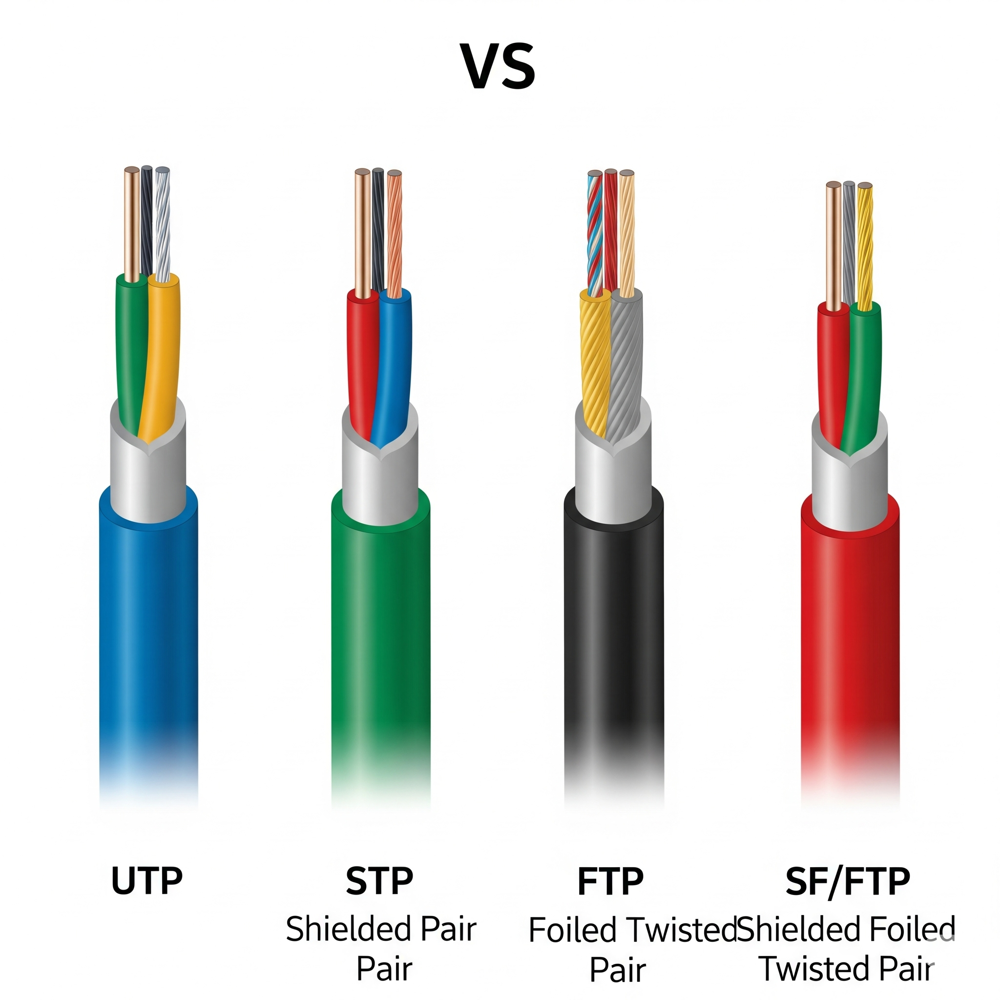
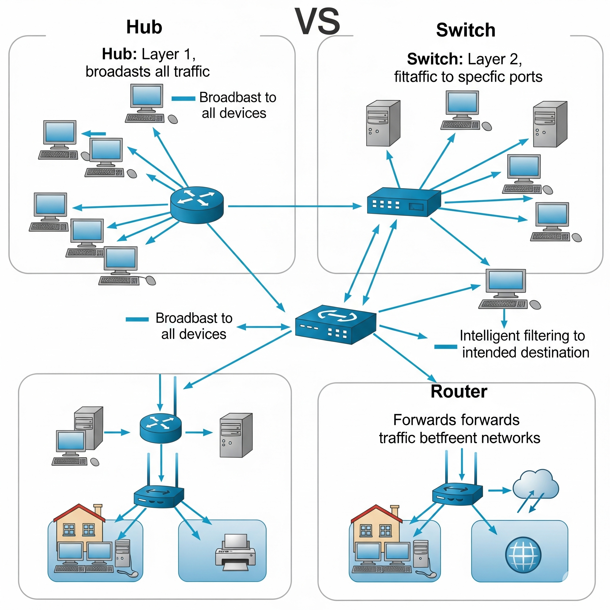
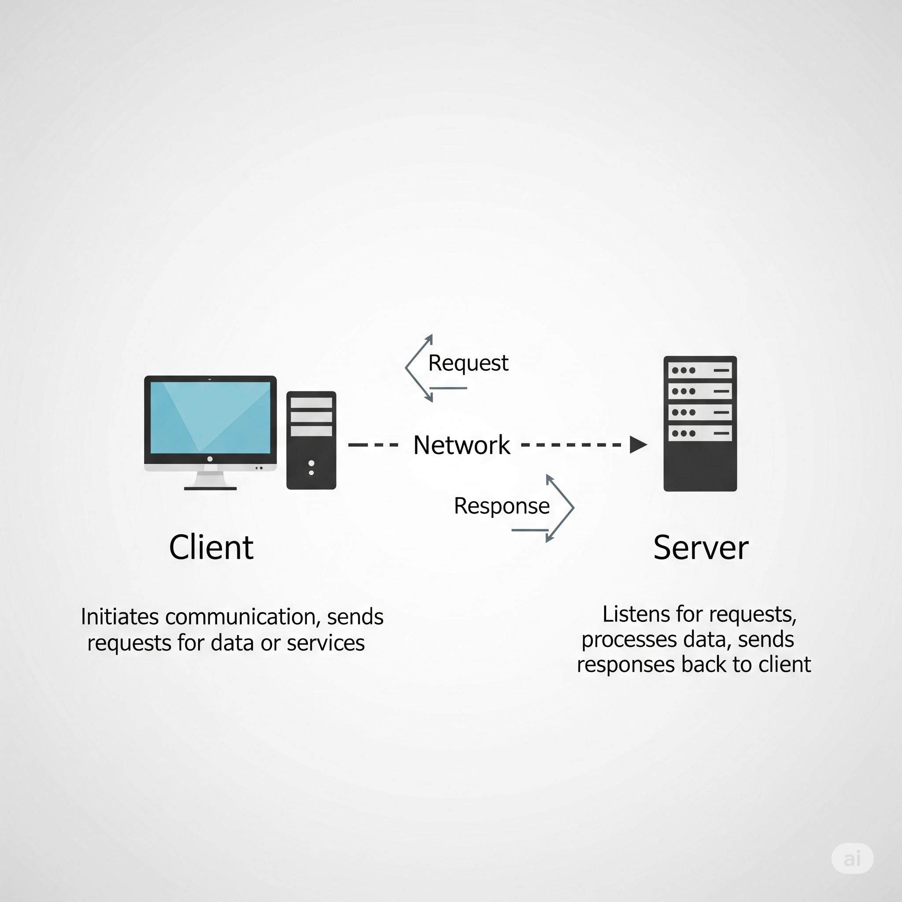
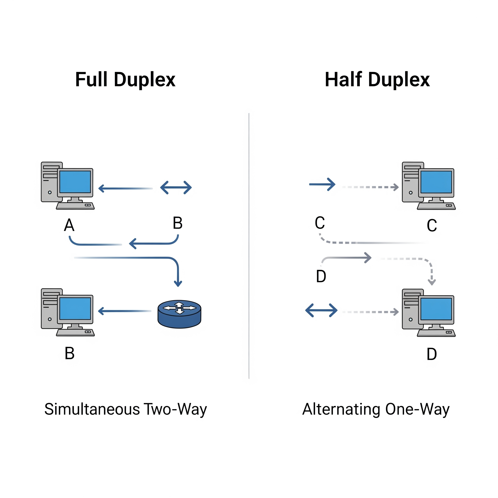
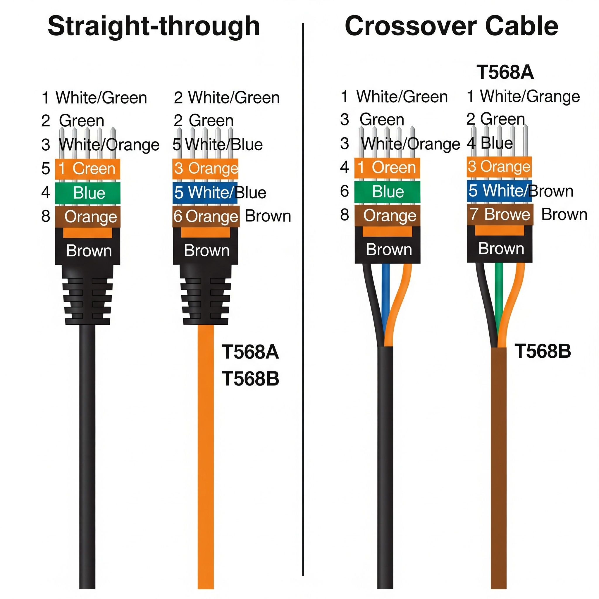
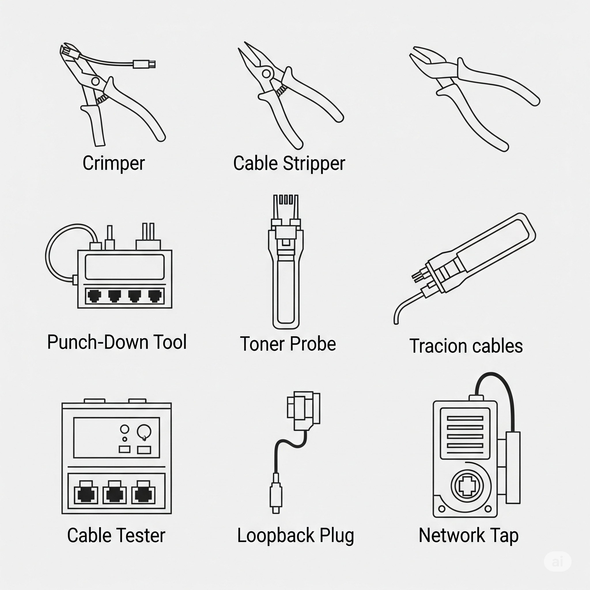
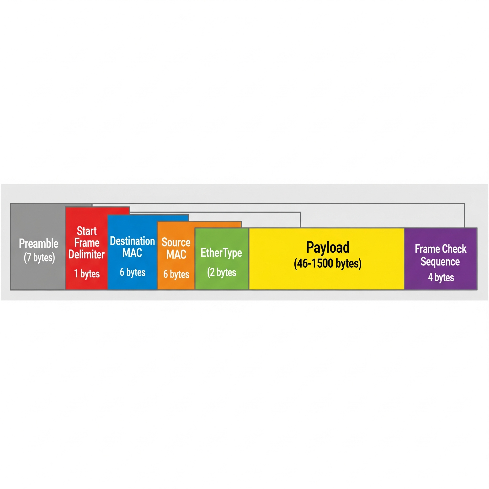
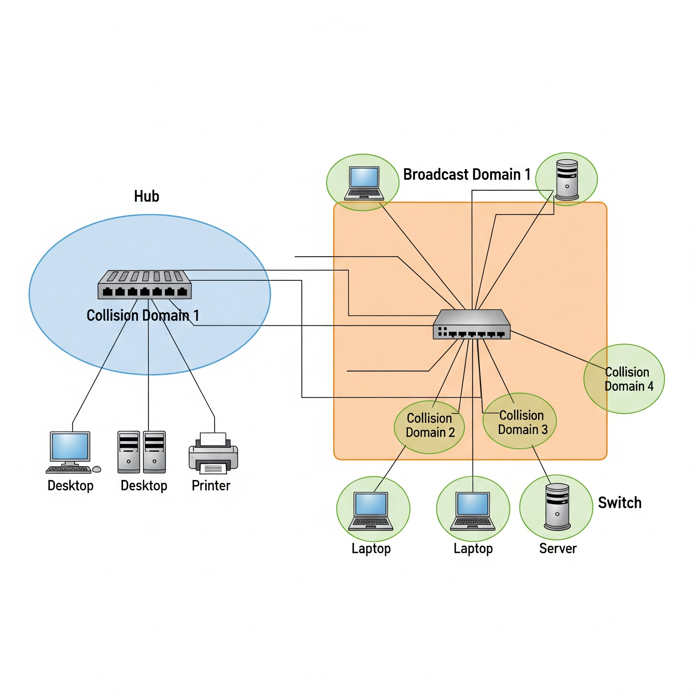

# Module 1 Learnings: The Bits and Bytes of Computer Networking

---

## The TCP/IP Five-Layer Network Model

The TCP/IP model organizes networking into five layers: Physical, Data Link, Network, Transport, and Application. This model helps explain how data moves from one device to another across networks.

---

## Supplementary Reading for The OSI Networking Model

The OSI model is a seven-layer conceptual framework used to understand and design networks. The layers are: Physical, Data Link, Network, Transport, Session, Presentation, and Application.

---

## Alex: Why Networking is Important

Networking enables devices to communicate, share resources, and access the internet. It is critical for businesses, homes, and everyday communication.

---

## Cables

Different types of cables connect devices in a network, including twisted pair, coaxial, and fiber optic cables. Each has unique properties for speed and interference protection.

---

## Hubs and Switches

Hubs broadcast data to all connected devices, while switches intelligently forward data only to the intended recipient device, improving network efficiency.

---

## Routers

Routers connect multiple networks together and direct data packets based on IP addresses, enabling devices on different networks to communicate.

---

## Servers and Clients

Servers provide services or data, and clients request and use these services. This client-server model is fundamental to networking.

---

## Moving Bits Across the Wire

Data is transmitted as bits (0s and 1s) over cables using electrical signals, light pulses, or radio waves, depending on the medium.

---

## Twisted Pair Cabling and Duplexing

Twisted pair cables contain pairs of wires twisted to reduce interference. Duplexing allows communication to occur in both directions on the cable—either one at a time (half-duplex) or simultaneously (full-duplex).

---

## Supplemental Reading for Ethernet Over Twisted Pair Technologies

Ethernet over twisted pair is the most common wired networking method in homes and businesses. It uses CAT5, CAT5e, or CAT6 cables to carry data.

---

## Ethernet Over Twisted Pair Technologies

Twisted pair Ethernet cables use four pairs of color-coded wires twisted together to reduce noise and interference.

---

### Types of Twisted Pair Ethernet Cables

- **Unshielded Twisted Pair (UTP):** Most common, low-cost, basic interference protection.
- **Shielded Twisted Pair (STP):** Includes shielding to protect against electromagnetic interference.
- **Foiled Twisted Pair (FTP):** Uses foil shielding for interference protection.
  
Some cables combine shielding types for enhanced protection.

---

## Straight-through Cable

Straight-through cables connect devices like computers to switches or routers. The wiring is the same on both ends.

---

## Twisted Pair Ethernet: Crossover Cables

Crossover cables connect similar devices directly, like switch-to-switch or computer-to-computer, by swapping transmit and receive wires.

---

## Network Ports and Patch Panels

Ports are physical connectors on devices. Patch panels organize multiple ports and cables for easier management.

---

## Cabling Tools

- **Crimper:** Used to attach connectors to cables.
- **Cable Stripper:** Removes protective cable jackets.
- **Wi-Fi Analyzer:** Measures wireless signal quality.
- **Toner Probe:** Helps trace cables by generating a tone.
- **Punch Down Tool:** Inserts wires into patch panels.
- **Cable Tester:** Tests cable integrity and performance.
- **Loopback Plug:** Tests ports by looping signals back.
- **Network Tap:** Copies network traffic for monitoring.

---

## Ethernet and MAC Addresses

MAC addresses uniquely identify network devices at the Data Link layer. Ethernet frames use MAC addresses to send data between devices.

---

## Unicast, Multicast, and Broadcast

- **Unicast:** Data sent to one device.
- **Multicast:** Data sent to a group of devices.
- **Broadcast:** Data sent to all devices on a network.

---

## Dissecting an Ethernet Frame

An Ethernet frame contains destination and source MAC addresses, data payload, and error-checking information to ensure data integrity.

---

## Glossary Terms from Module 1

Some key terms:

- **Bit:** Smallest unit of data.
- **Client:** Device requesting services.
- **Router:** Device directing data between networks.
- **Switch:** Device forwarding data within a network.
- **Full Duplex:** Communication in both directions simultaneously.
- **Half Duplex:** Communication one direction at a time.
- **CSMA/CD:** Protocol to avoid collisions in network communication.
- **VLAN:** Virtual LAN separating network traffic logically.

---

