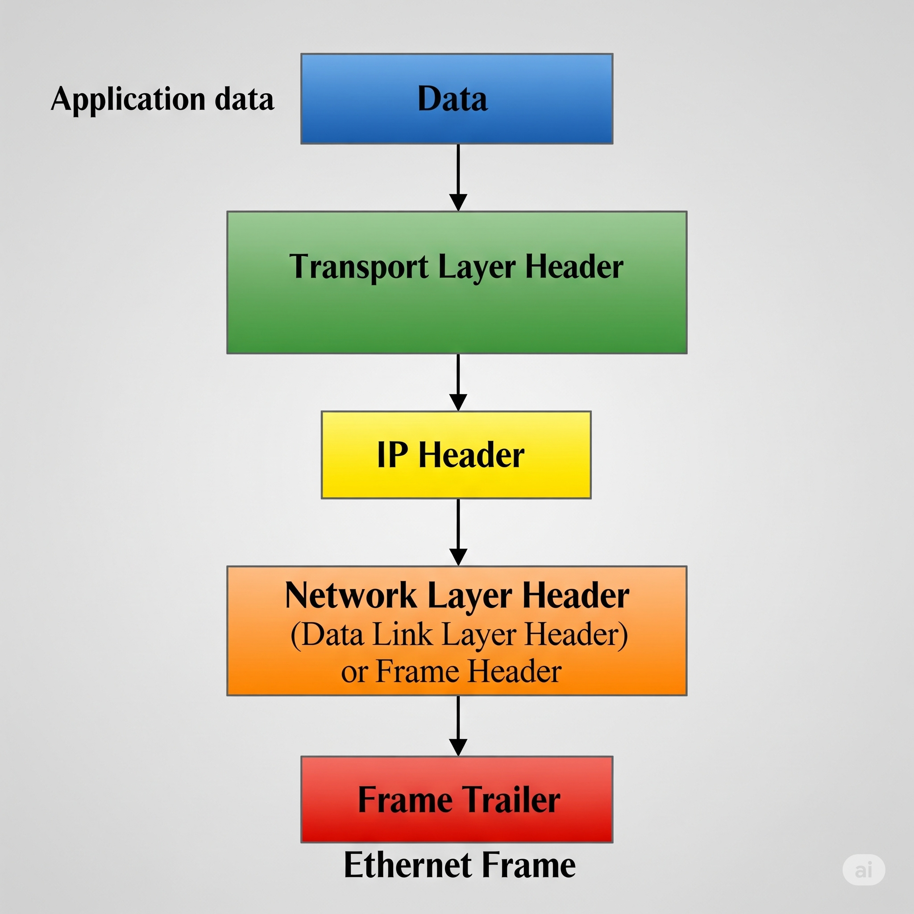
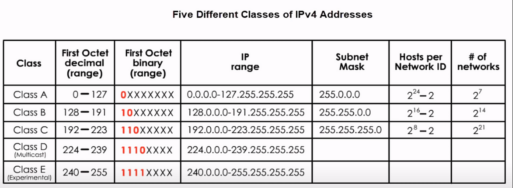
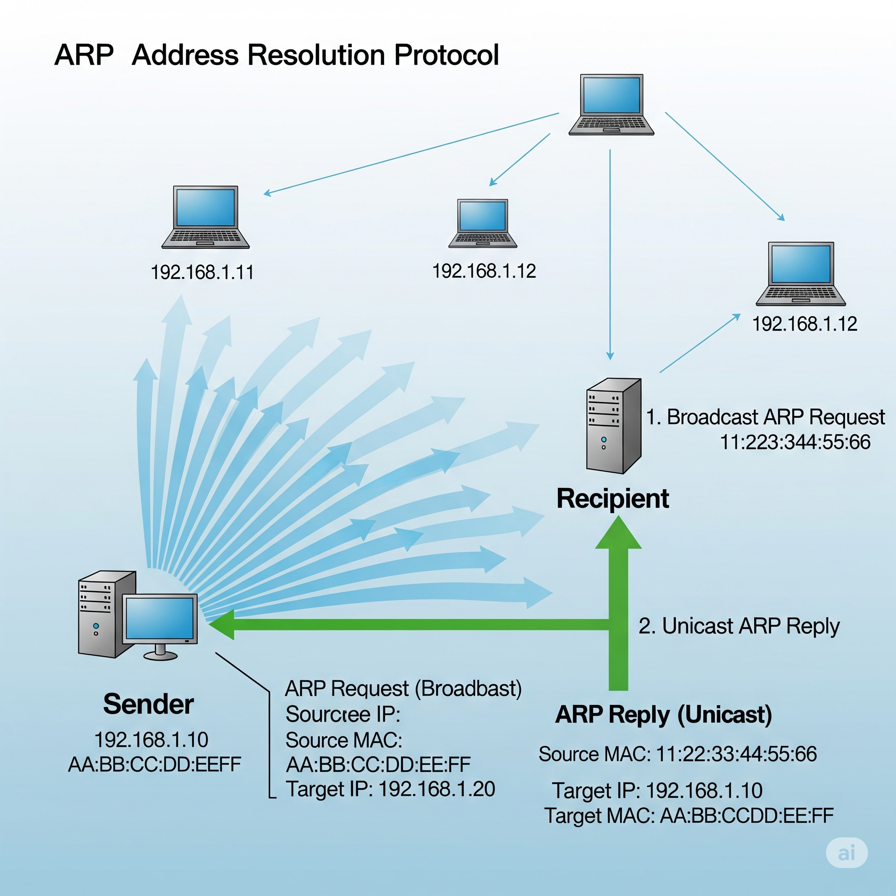
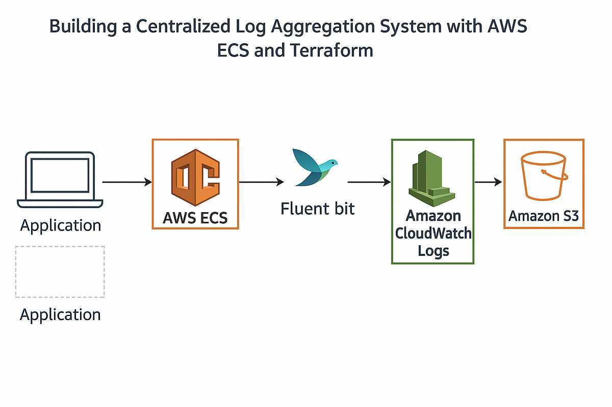
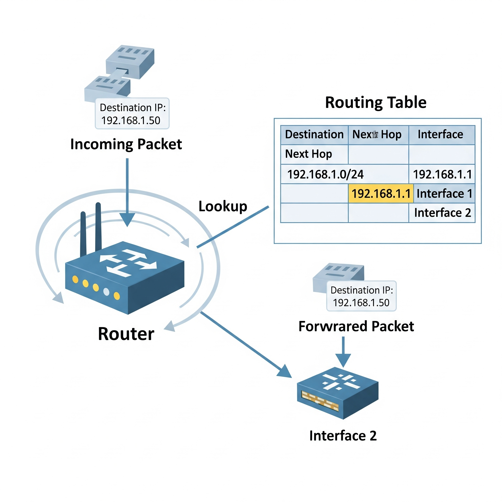
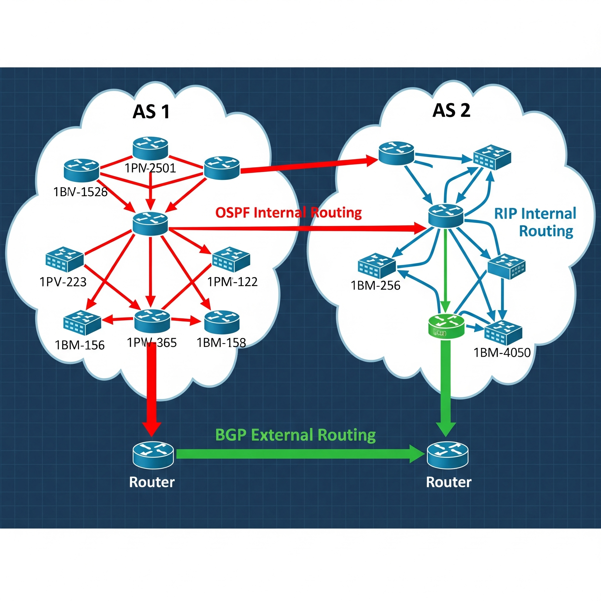
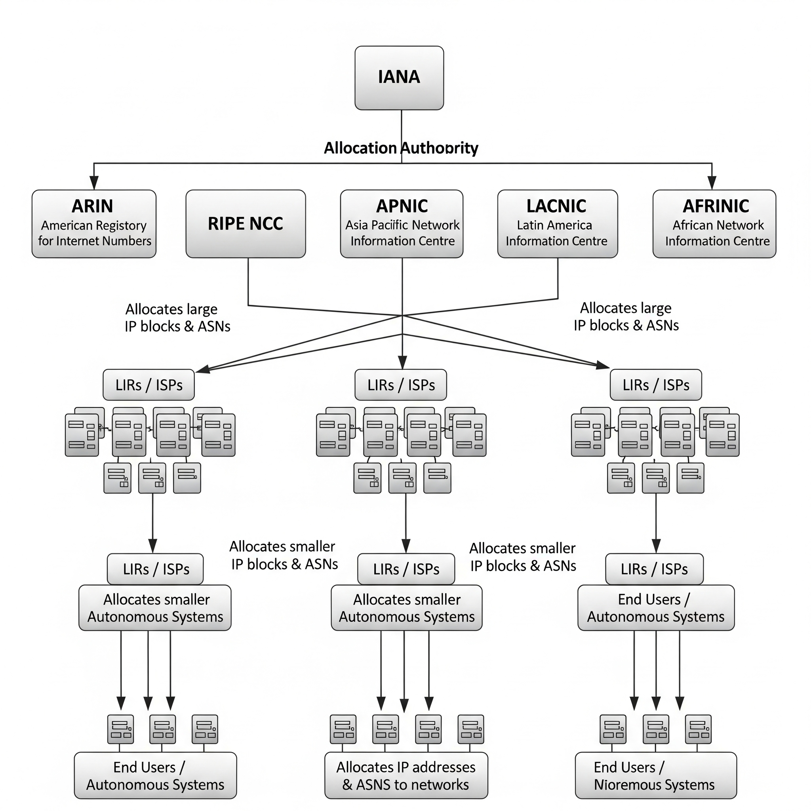

# Module 2: The Network Layer

---

## Introduction to The Network Layer

The network layer is responsible for facilitating communication between different networks using routers. It ensures data is sent from one node to another across networks.

---

## The Network Layer

This layer uses IP (Internet Protocol) to assign unique addresses and handle the delivery of packets across different networks.

---

## IPv4 Addresses

IPv4 uses 32-bit addresses, typically shown in dotted decimal notation (e.g., 192.168.1.1). These addresses are unique identifiers for devices on a network.

---

## IPv4 Datagram and Encapsulation

An IP datagram wraps the data from upper layers with IP header information (like source and destination addresses). It is then encapsulated into a frame at the data link layer.

---

## IPv4 Address Classes

IPv4 addresses are grouped into five classes: A, B, C, D, and E. Each class has specific IP ranges and default subnet masks.

---

## Address Resolution Protocol (ARP)

ARP is used to map IP addresses to MAC addresses. When a device doesn’t know the MAC address for a given IP, it sends an ARP request; the corresponding device replies with its MAC.

---

## Subnetting

Subnetting divides a large network into smaller subnetworks. It improves routing efficiency and security.

---

## Subnet Masks

A subnet mask determines which portion of an IP address is the network and which is the host.

---

## Basic Binary Math

Networking relies on binary for operations like calculating IP ranges and subnetting. For example, 192.168.1.0/24 means the first 24 bits are network bits.

---

## CIDR (Classless Inter-Domain Routing)

CIDR replaces the old class-based addressing. It uses slash notation (e.g., /24) to denote how many bits are network bits, allowing more efficient IP allocation.

---

## Basic Routing Concepts

Routers use routing tables to determine where to send packets based on destination IP addresses.

---

## Routing Tables

Each router maintains a routing table listing known networks and how to reach them—either directly or via another router (next hop).

---

## Interior Gateway Protocols

Interior gateway protocols like RIP and OSPF allow routers within a single autonomous system to share route information.

---

## Exterior Gateways, Autonomous Systems, and the IANA

BGP (Border Gateway Protocol) is used between autonomous systems. These systems are assigned ASN numbers by IANA and share routing information at a global level.

---

## Supplemental Reading for Routing Protocol Examples

- **RIP** – A simple distance vector protocol.
- **EIGRP** – Cisco’s proprietary enhancement of RIP.
- **OSPF** – A link-state protocol used within autonomous systems.
- **BGP** – The standard protocol for routing between autonomous systems.

---

## Non-Routable Address Space

Some IPv4 address ranges are reserved for private networks and cannot be routed on the public internet. Examples include:
- 10.0.0.0/8
- 172.16.0.0/12
- 192.168.0.0/16
- 127.0.0.1 (loopback)
- 169.254.0.0/16 (link-local)

---

## Supplemental Reading for RFCs and Standards

The IETF publishes **RFCs (Request for Comments)** that define internet standards and protocols. You can explore these on [ietf.org](https://ietf.org).

Fun RFCs:
- **RFC 1149** – IP over Avian Carriers
- **RFC 3514** – The evil bit

---

## Glossary

- **ARP Table**: A cache that stores IP-to-MAC mappings.
- **CIDR**: Classless Inter-Domain Routing; allows flexible IP allocation.
- **Next Hop**: The next router a packet should go to.
- **Subnet**: A smaller network created from a larger one.
- **NAT**: Network Address Translation, used to map private IPs to public IPs.
- **TTL**: Time-To-Live, the number of hops a packet can make before being discarded.

---

## Conclusion

The Network Layer ensures that devices across networks can communicate effectively by using protocols like IP, ARP, and routing protocols such as RIP, OSPF, and BGP.

---

