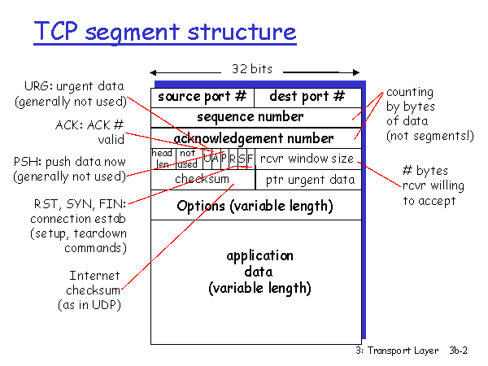
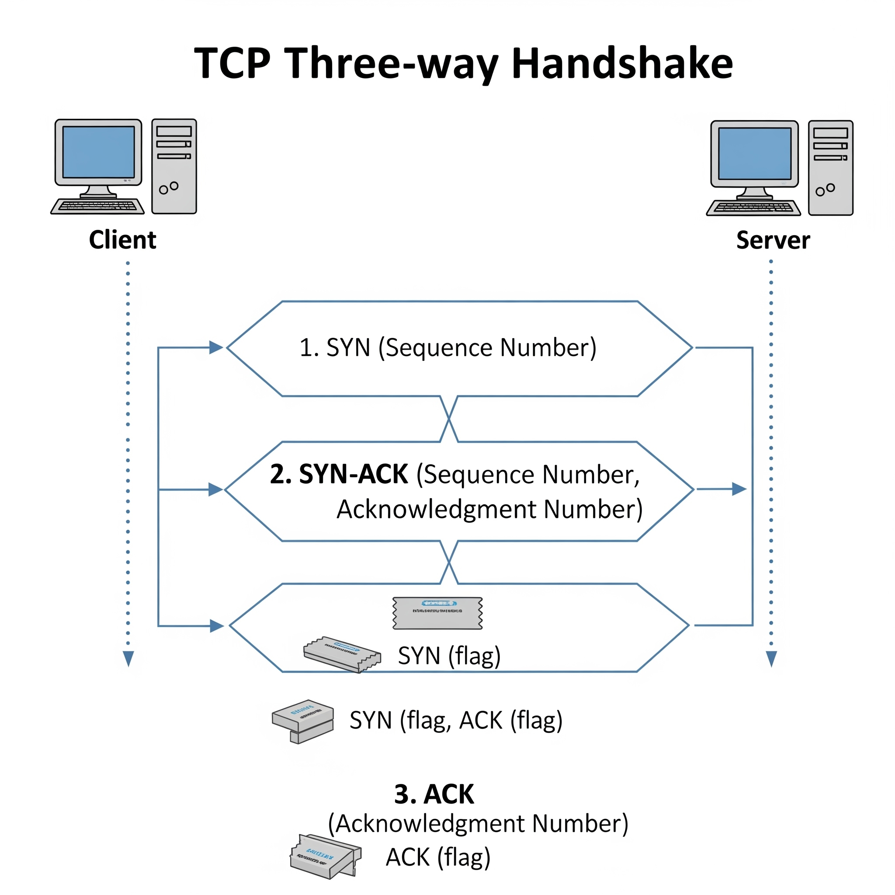
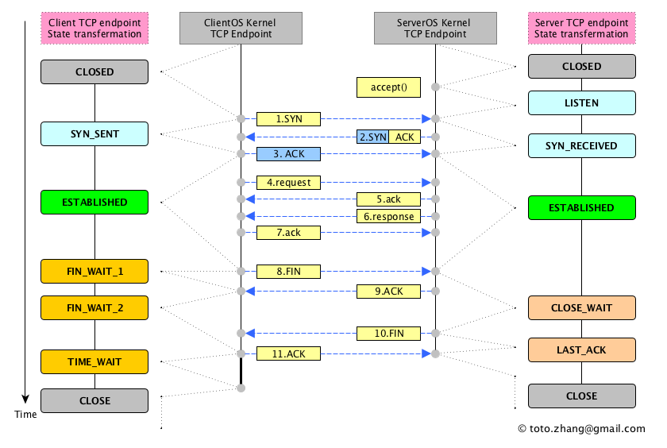
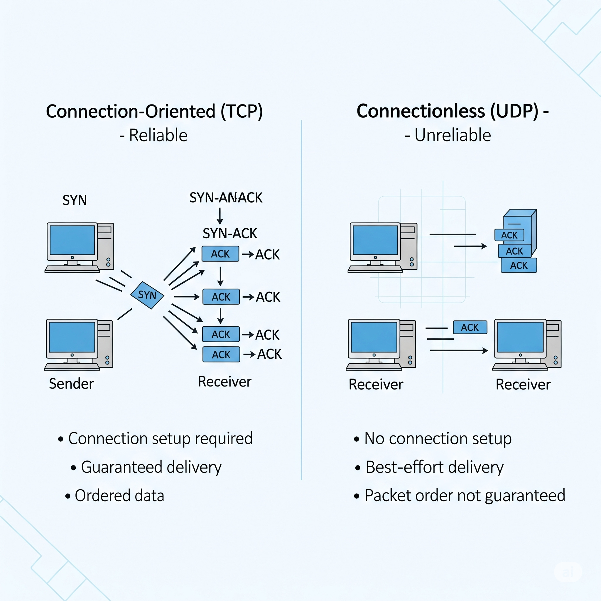
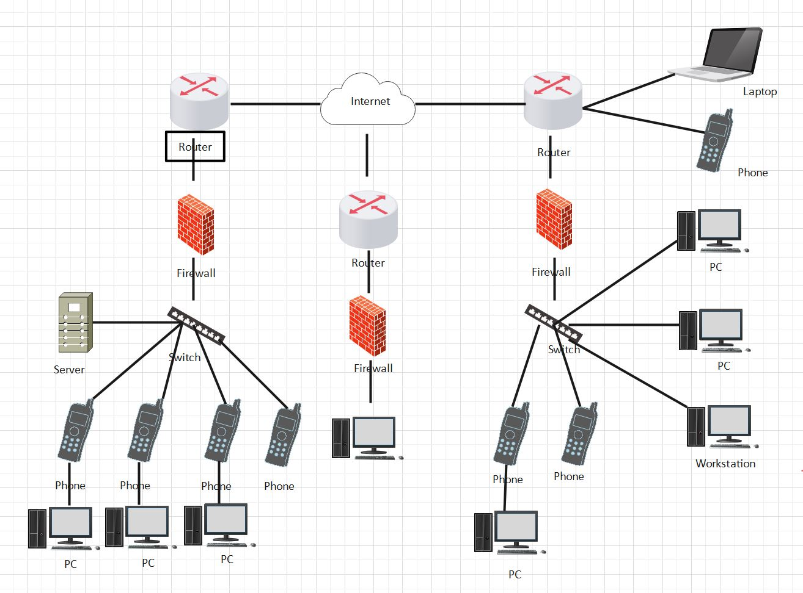
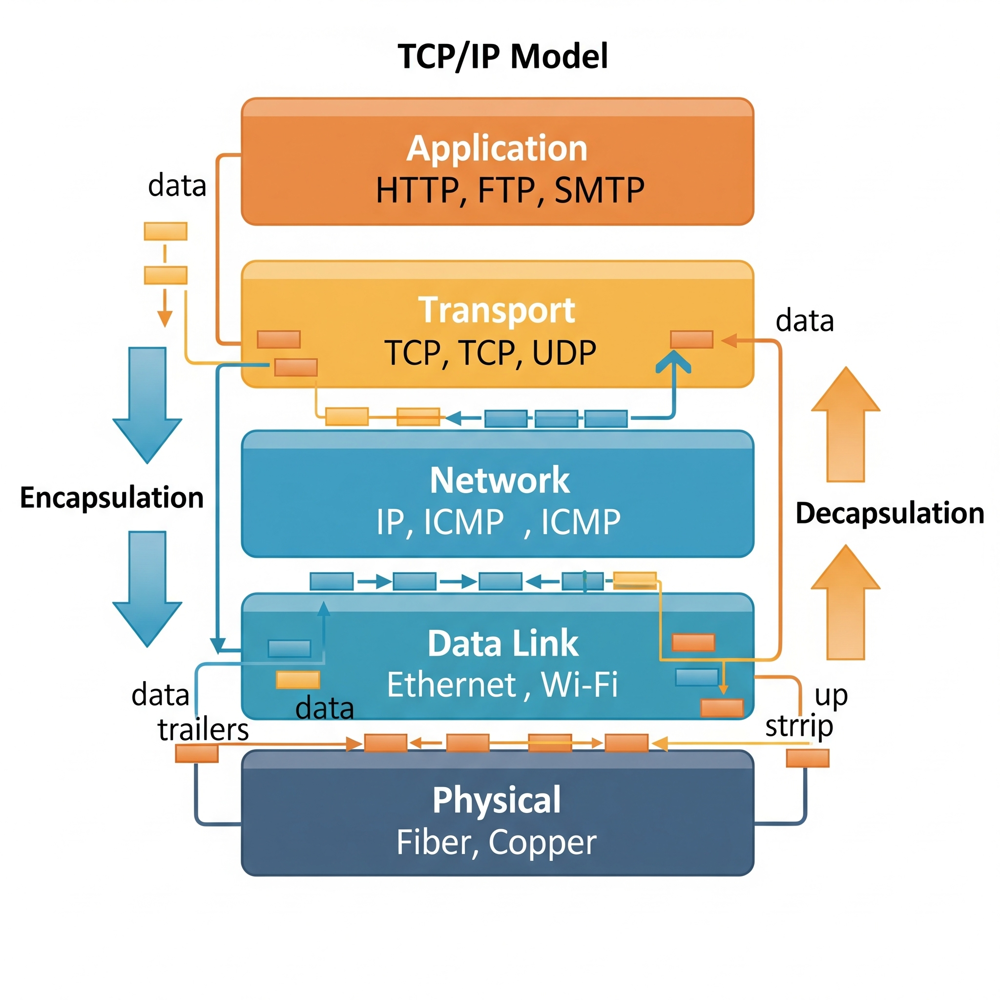

# Module 3  
## The Transport and Application Layers

- **Introduction to the Transport and Application Layers**  
  Overview of how the Transport and Application layers fit within the network stack and their main roles in enabling end-to-end communication and providing services to applications.

- **The Transport Layer**  
  Explains how the transport layer manages data delivery between hosts, including segmentation, flow control, error correction, and multiplexing.

- **Dissection of a TCP Segment**  
  Breaks down the structure of a TCP segment, detailing fields such as source and destination ports, sequence number, acknowledgment number, flags, and window size.  
  

- **TCP Control Flags and the Three-way Handshake**  
  Describes the purpose of TCP control flags (SYN, ACK, FIN, etc.) and explains the three-way handshake process for establishing a reliable TCP connection.  
  

- **TCP and UDP Packets**  
  Compares TCP and UDP protocols, highlighting TCP’s connection-oriented nature with reliability features versus UDP’s connectionless, faster, but less reliable communication.  
  

- **TCP Socket States**  
  Shows the different states a TCP socket can be in during the lifecycle of a connection, including LISTEN, SYN_SENT, ESTABLISHED, FIN_WAIT, and TIME_WAIT.  
  

- **Connection-oriented and Connectionless Protocols**  
  Explains the difference between protocols that establish connections before data transfer (like TCP) versus those that do not (like UDP).  
  

- **Supplemental Reading for System Ports versus Ephemeral Ports**  
  Discusses the difference between well-known system ports (used by servers) and ephemeral ports (temporary ports assigned to client processes).

- **Firewalls**  
  Introduces firewalls and their role in network security, controlling traffic flow based on predetermined security rules.  
  

- **The Transport Layer Practice Assignment**  
  Practical exercises to reinforce understanding of the transport layer concepts.

- **The Application Layer**  
  Overview of the application layer’s role in providing network services directly to end-user applications, such as HTTP, FTP, DNS.

- **The Application Layer and the OSI Model**  
  Connects application layer functions to the OSI model framework, highlighting how data is prepared for transmission.

- **All the Layers Working in Unison**  
  Demonstrates how all five layers of the network stack work together to facilitate communication between devices.  
  

- **Learner Story: Daniel**  
  A narrative sharing how the learner applied networking concepts in real-world scenarios.

- **Glossary terms from course 2, module 3**  
  Key terminology and definitions relevant to the transport and application layers.

- **The Application Layer Practice Assignment**  
  Exercises focused on the concepts and protocols of the application layer.

- **Module 3 study guide: The Transport and Application Layer**  
  A summary guide covering the essential topics and concepts of the module.

- **Module 3 challenge: The Five-Layer Network Model**  
  An assessment to test knowledge and application of the five-layer network model concepts.
