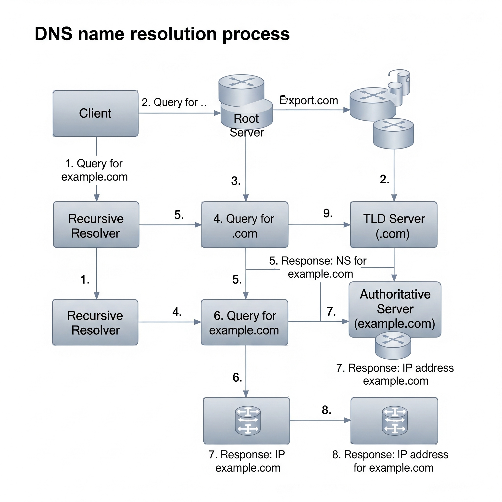
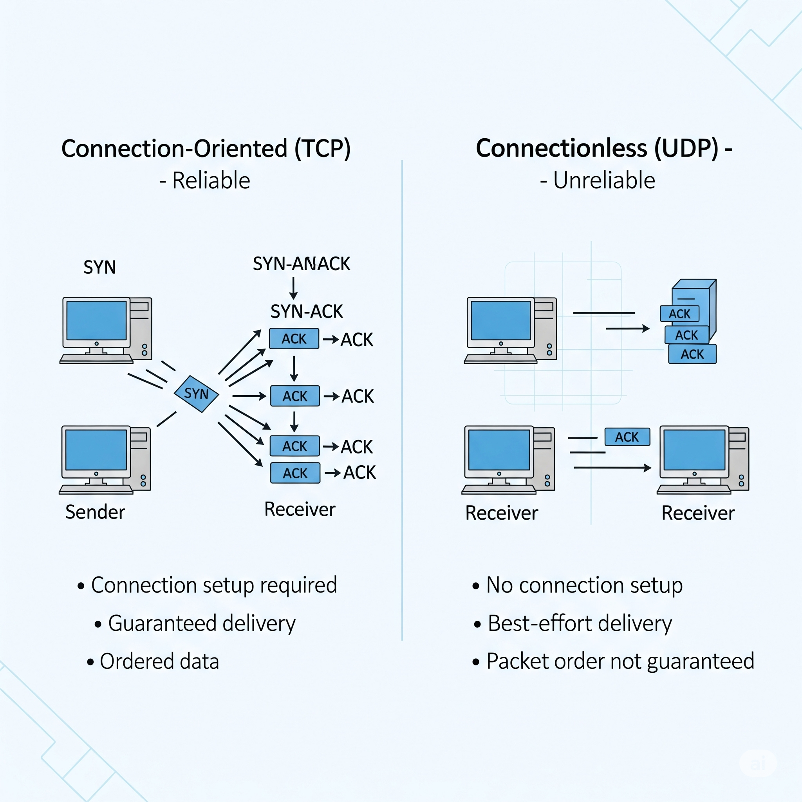
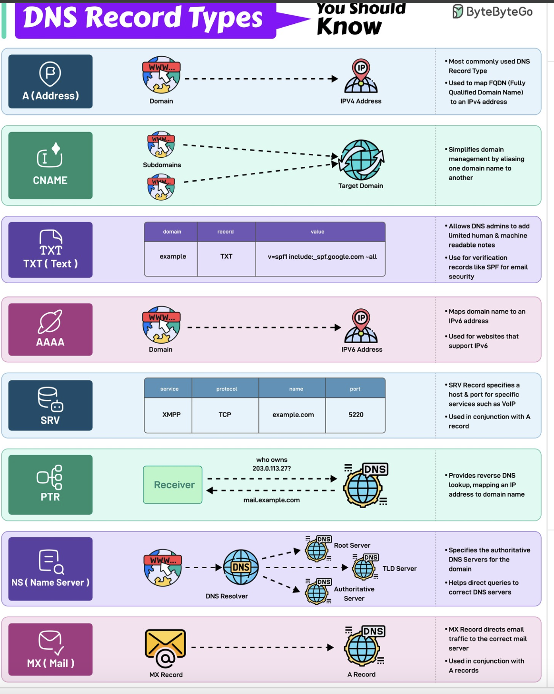
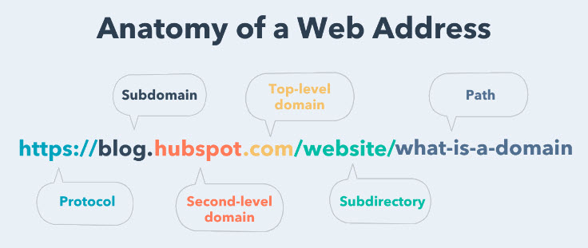
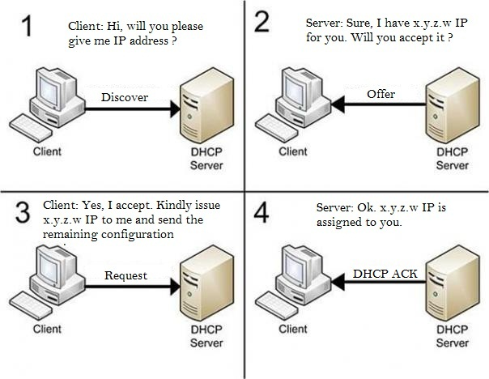
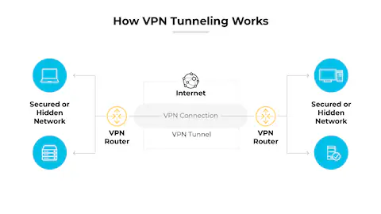
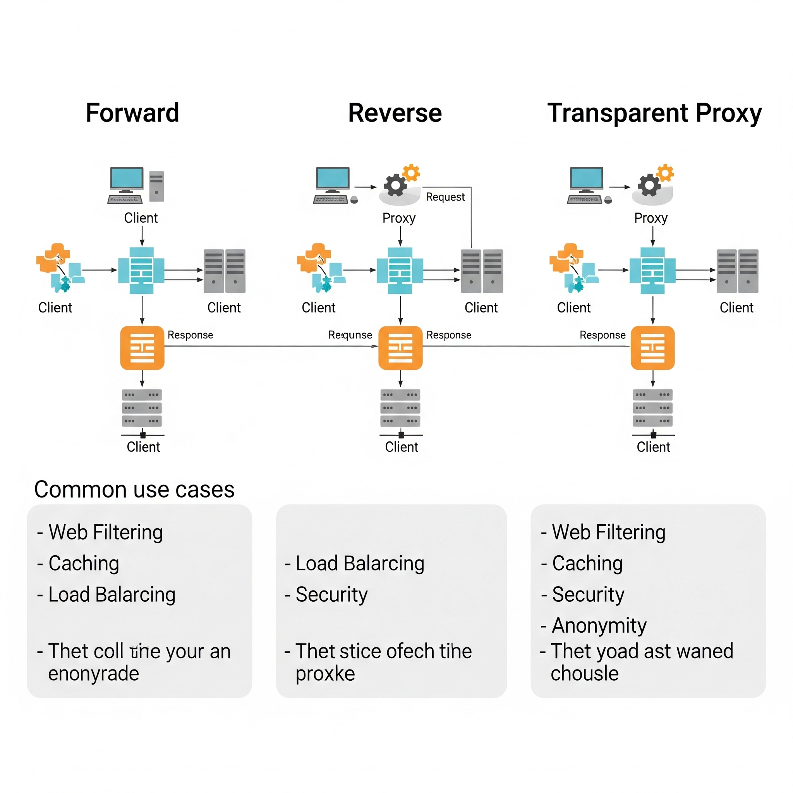

# Module 4  
## Networking Services

---

### Introduction to Network Services  
A high-level overview of essential networking services that support communication over the internet, including DNS, DHCP, NAT, VPNs, and proxies.

---

### Why Do We Need DNS?  
The Domain Name System (DNS) translates human-friendly domain names like `www.google.com` into IP addresses that machines use to identify each other on the network.

---

### The Many Steps of Name Resolution  
This topic walks through the recursive DNS lookup process:  
- Client contacts the **recursive resolver**  
- Resolver queries **root server**, then **TLD server**, and finally the **authoritative name server**  
- Response is returned to the client

---

### DNS and UDP  
DNS uses **UDP** for most queries due to its low overhead, but switches to **TCP** when large data (like zone transfers) are needed.

---

### Name Resolution Practice Assignment  
Reinforces the DNS resolution flow and understanding of client-server interaction during lookups.

---

### Sergio: A Journey to the IT Field  
A learner story highlighting a personal journey into IT and understanding of networking concepts.

---

### Resource Record Types  
DNS supports various record types:  
- `A`: Maps hostname to IPv4  
- `AAAA`: Maps hostname to IPv6  
- `CNAME`: Canonical names  
- `MX`: Mail servers  
- `TXT`: Text data  
- `SRV`: Services  
- `NS`: Name servers  

---

### Anatomy of a Domain Name  
Explains the structure of domain names like `www.google.com` with labels:  
- `www`: Subdomain  
- `google`: Domain  
- `.com`: Top-Level Domain (TLD)

---

### DNS Zones  
Defines administrative responsibility for DNS records. Each zone is managed by a name server and may include multiple domains or subdomains.

---

### Name Resolution in Practice  
Hands-on understanding of DNS in real-world networking scenarios through practice.

---

### Overview of DHCP  
DHCP automates IP assignment using the **DORA process**:  
- Discover  
- Offer  
- Request  
- Acknowledge  

---

### DHCP in Action  
Illustrates how devices dynamically receive configuration from a DHCP server when joining a network.

---

### Dynamic Host Configuration Protocol (DHCP) Practice  
Applies DHCP knowledge by configuring dynamic IP assignments in network simulations.

---

### Basics of NAT  
NAT allows multiple private IP addresses to share a single public IP. Essential for conserving IPv4 addresses.

---

### NAT and the Transport Layer  
NAT tracks internal-to-external connections using IP and port mappings. This enables multiple devices behind one public IP.

---

### Exhaustion – Supplemental Reading for IPv4 Address  
Explores the scarcity of IPv4 addresses and why techniques like NAT and IPv6 are important for the future of networking.

---

### Network Address Translation Practice  
Apply NAT concepts in lab environments, configuring routers to route private-to-public traffic.

---

### Virtual Private Networks  
VPNs use encrypted tunnels to allow remote users to securely access private networks over public infrastructure.

---

### Proxy Services  
Proxies act as intermediaries between clients and the internet, enabling content filtering, caching, and hiding of IP addresses.

---

### VPNs & Proxies Practice  
Learn to configure and use VPNs and proxies to simulate secure access and filtered traffic in real environments.

---

### Glossary Terms – Module 4  
A reference list of new and previously covered terms relevant to DNS, DHCP, NAT, VPNs, and proxies.

---

### Networking Services Simulation  
Interactive assignment where learners simulate DNS, DHCP, NAT, and proxy services in virtual network environments.

---
