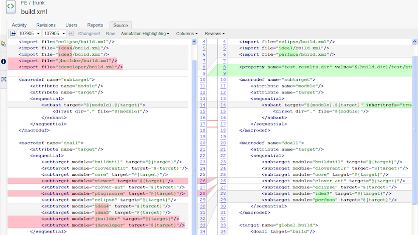
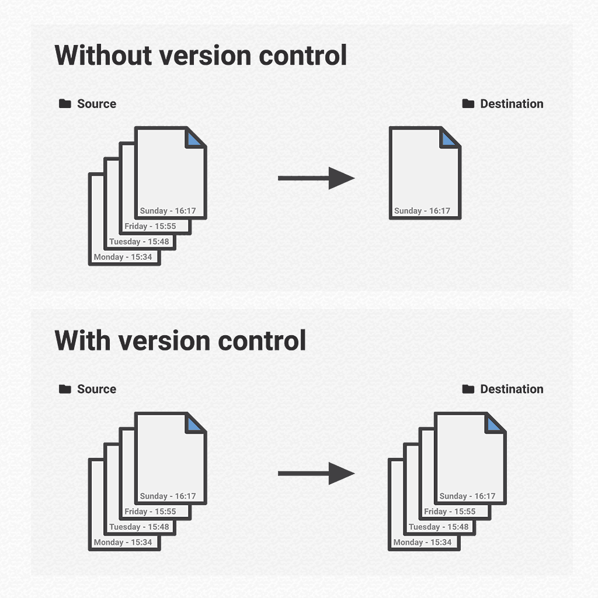
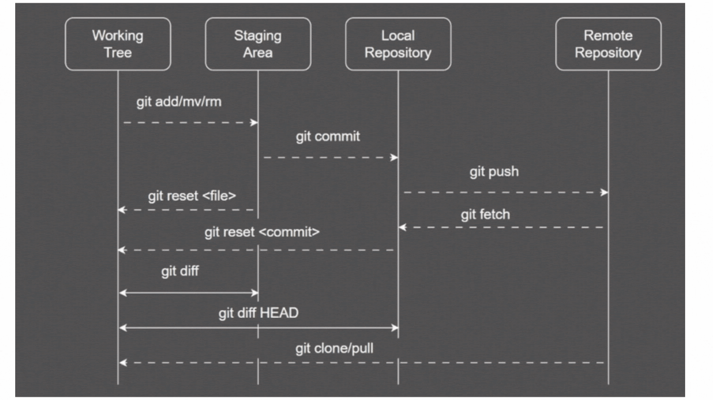

# 📘 Learnings from "Introduction to Git and GitHub" – Module 1

## 👋 Course Introduction

Welcome to the **Google course on Git and GitHub**! This course introduces you to the fundamental concepts of **version control**, especially using **Git**, a powerful system used by developers all over the world. By the end of this course, you'll know how to track changes, collaborate with others, and manage your project versions effectively using Git and GitHub.

---

## 🧱 Intro to Module 1: Version Control

This module focuses on understanding **why version control matters**, what problems it solves, and how tools like Git streamline development.

---

## 🕒 Keeping Historical Copies

Before version control systems, developers used manual methods like:
- Copying folders with timestamps
- Renaming files (`project_final_v2_REAL_final.zip 😅`)

These methods were inefficient, error-prone, and hard to collaborate on.

---

## 🔍 Diffing Files

**Diffing** is the process of comparing two versions of a file and highlighting the differences. It's essential for:
- Understanding what changed
- Collaborating with others
- Applying patches

📸  


---

## 🛠️ Applying Changes

Using the `diff` output, you can generate **patch files** that contain only the changes made. These patches can be applied using the `patch` command to update files automatically.

---

## 🧪 Practical Application of Diff and Patch

You can use `diff` and `patch` tools to:
- Compare changes
- Generate `.patch` files
- Apply changes across systems or environments

It mimics how Git manages internal file differences.

---

## ❓ Practice Quiz: Before Version Control

A short quiz reinforced the limitations of manual file tracking and the need for automated tools.

---

## 📘 Study Guide: diff and patch

This reading summarized:
- Syntax for `diff` and `patch`
- Practical use-cases
- Command-line examples

---

## 📂 What is Version Control?

Version control allows developers to:
- Track every change to code
- Revert to previous versions
- Collaborate without conflict

📸  


---

## 🤖 Version Control and Automation

With automation:
- Developers can trigger tests, builds, and deployments based on version changes
- CI/CD becomes possible
- Collaboration and scaling become seamless

---

## 🐙 What is Git?

**Git** is a **distributed version control system** created by Linus Torvalds in 2005.

Key features:
- Local repositories
- Fast operations
- Branching and merging

📸  


---

## 📚 More Information About Git

Additional reading helped clarify Git's internal structure:
- Object model (blobs, trees, commits)
- How it stores data
- Efficiency compared to other VCS

---

## 🧩 Installing Git

Git can be installed on:
- Windows
- macOS
- Linux

Basic setup includes:
```bash
git config --global user.name "Your Name"
git config --global user.email "you@example.com"
```

-Use Git via terminal or Git Bash

## ✅ Practice Quiz: Version Control Systems

Reinforced understanding of:
- Centralized vs Distributed Version Control Systems
- Git’s key advantages: offline work, speed, and branching
- Important version control terminology
---

## 🛫 Review: First Steps with Git

The first steps with Git include:
- Initializing repositories
- Configuring Git identity
- Making the first commit
---

## 🧾 First Steps with Git

Basic Git setup and commit process:
```bash
git init
git status
git add file.txt
git commit -m "Initial commit"
```
---
## 📁 Review: Tracking Files

Git tracks files in three main stages:

Working directory – your local file system

Staging area – files you’ve marked to be committed

Repository – permanent history of commits

Understanding this process is key to mastering Git.

🔁 Tracking Files

Using the following Git commands, you manage file states:
```bash
git status
git add <file>
git commit -m "message"
```
---
**Git only tracks files you explicitly add to staging.**

## 🔄 Review: The Basic Git Workflow

Summarized the Git workflow from:

**Editing files → Staging changes → Committing → Pushing to remote**
---

## ⚙️ The Basic Git Workflow

Steps in the Git workflow:
```bash
# 1. Check status
git status

# 2. Stage changes
git add <file>

# 3. Commit changes
git commit -m "Message"

# 4. Push to GitHub
git push origin main

```
📸

---
## 🧠 Review: Anatomy of a Commit Message

Good commit messages are crucial for collaborative development. A message should:
- Be short and descriptive in the subject line
- Optionally include a detailed body
- Follow a consistent convention or style
---

## ✍️ Anatomy of a Commit Message

📸


### Structure Example:
```bash
feat: Add user login functionality

This commit adds authentication logic to the backend using JWT tokens.
It includes error handling and unit tests.

Fixes #42
```
---
## 📚 Study Guide: Git

The guide summarized:
- Frequently used commands
- How Git stores history using commits
- Real-world scenarios where Git improves team collaboration
---


## ✅ Module 1 Wrap-Up

In this module, we learned:
- Why version control is critical for teams and solo developers
- How Git enables efficient workflows
- The core commands needed to track, commit, and push code 

---

## 📖 Glossary Terms

Key terms explained in the course:
`Repository` – A storage space for code and history
`Commit` – A saved change to the codebase
`Branch` – A parallel line of development
`Merge` – Combining changes from different branches
`Clone` – Copying a repository to your local machine
`Push / Pull` – Sending or receiving changes from a remote repo

---

## 💡 Qwiklabs Guidelines and Troubleshooting

Tips to successfully complete Qwiklabs:
- Follow lab instructions precisely
- Use Git Bash or Cloud Shell for commands
- Save your work regularly
- Don’t refresh browser windows during lab sessions
---

## 🧪 Qwiklabs Assessment: Introduction to Git

This ungraded lab tested your ability to:
- Initialize a Git repository
- Add and commit files
- Push changes to a GitHub repository
- It was a practical application of everything covered so far.
---
## 🎉 Conclusion

This module provided the foundation to understand version control, install and use Git, and apply its core commands in real-world development environments. You're now ready to collaborate confidently on codebases using Git and GitHub.
---
> _This summary was prepared by Dheraj_k based on interaction with AI assistance and content from Google’s Coursera course._

