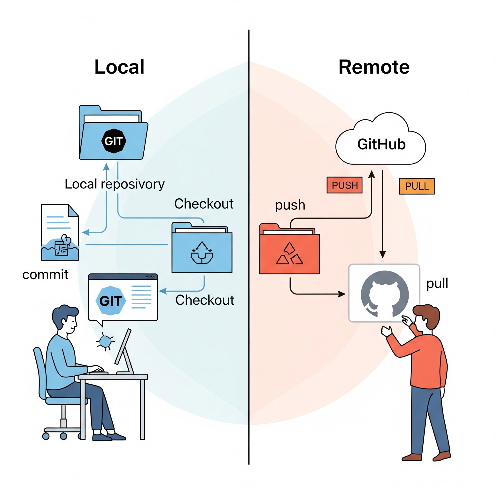
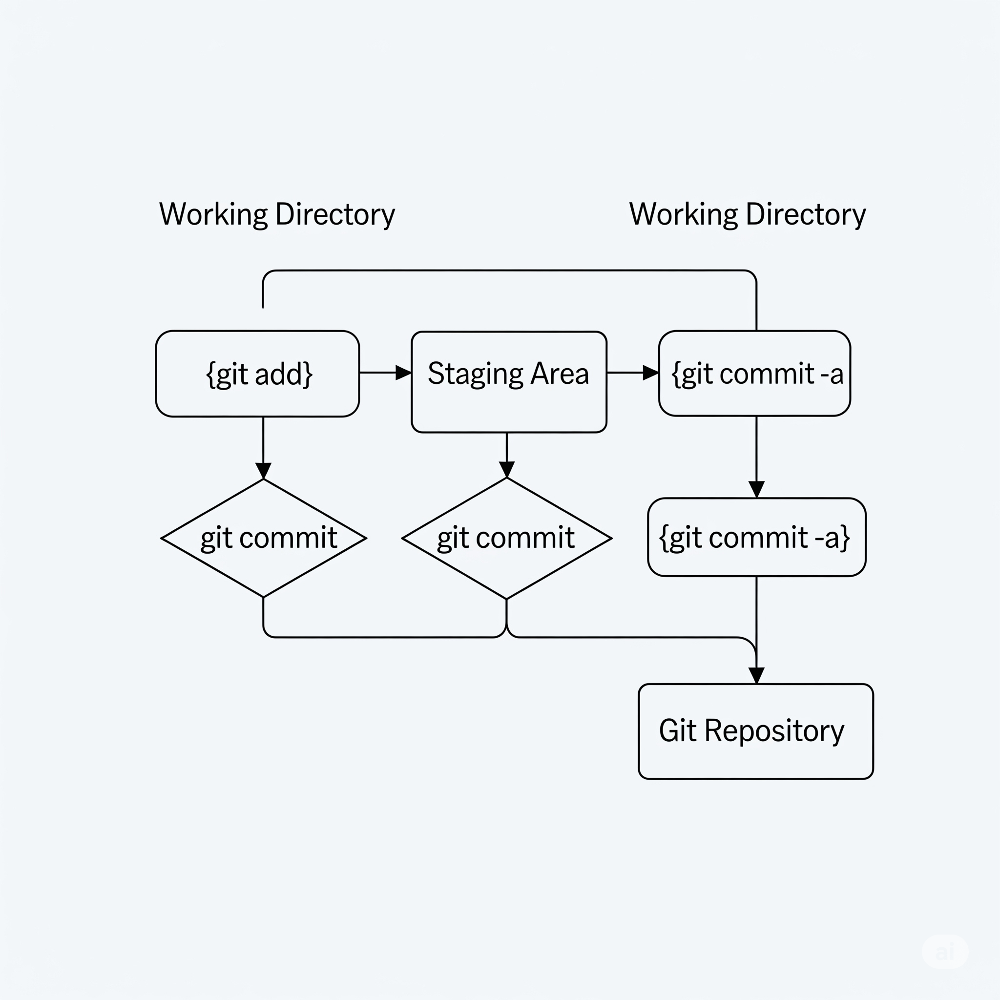
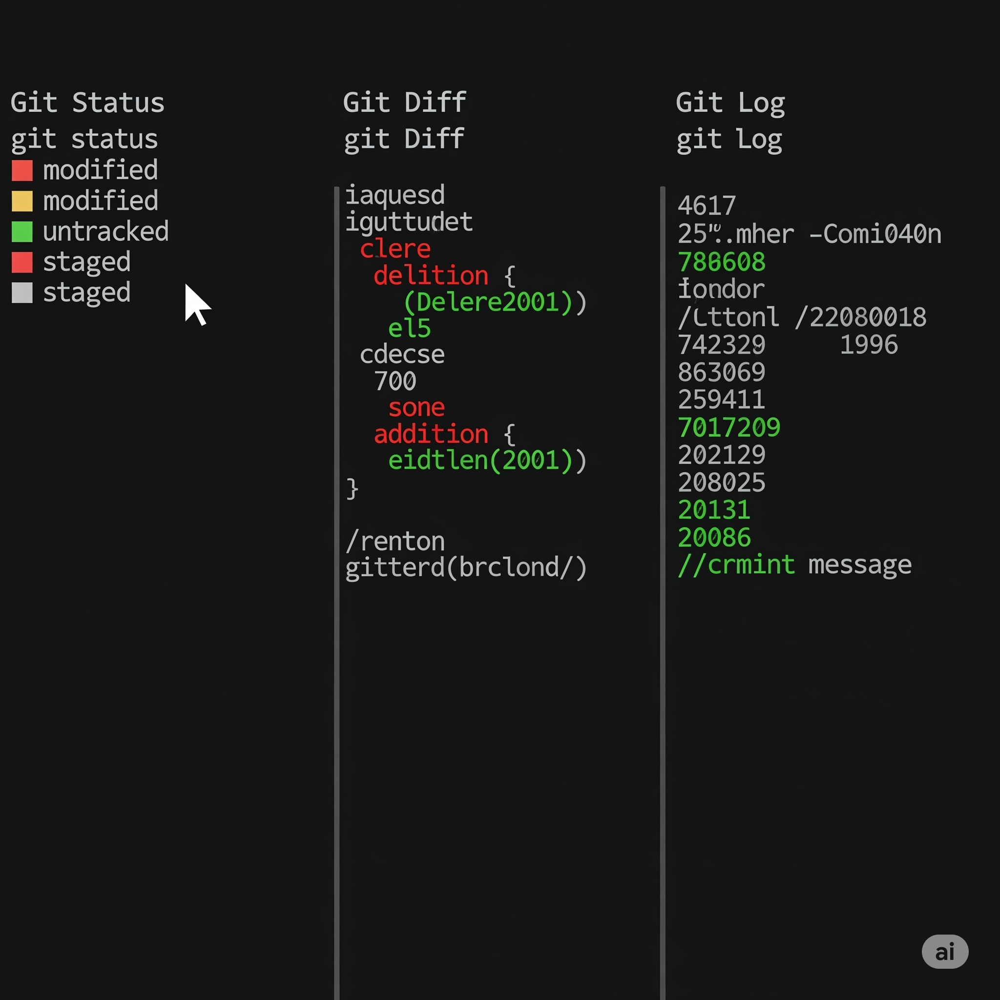
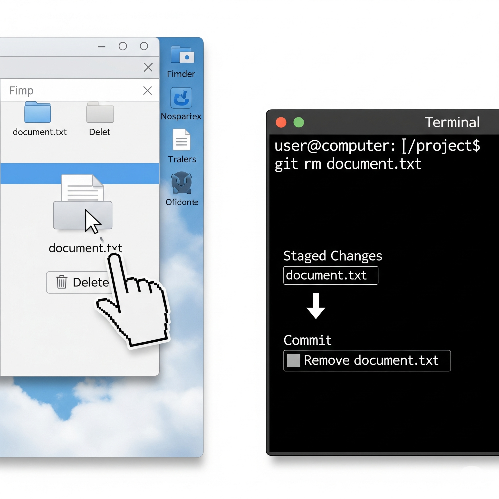
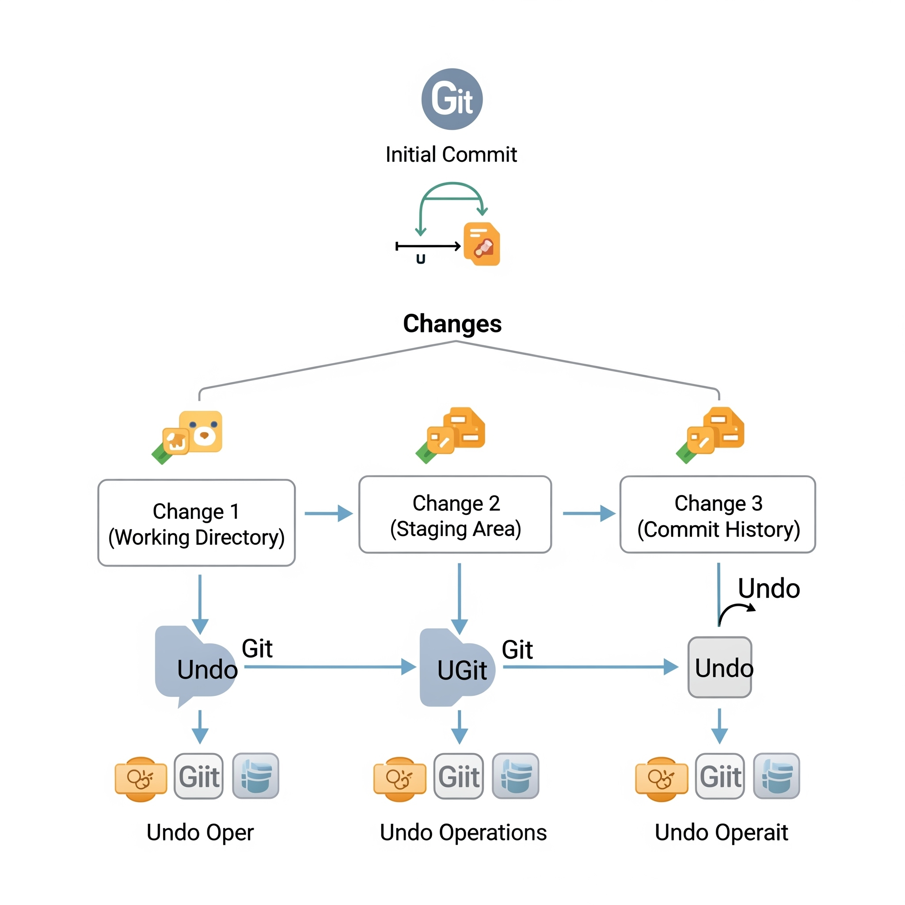
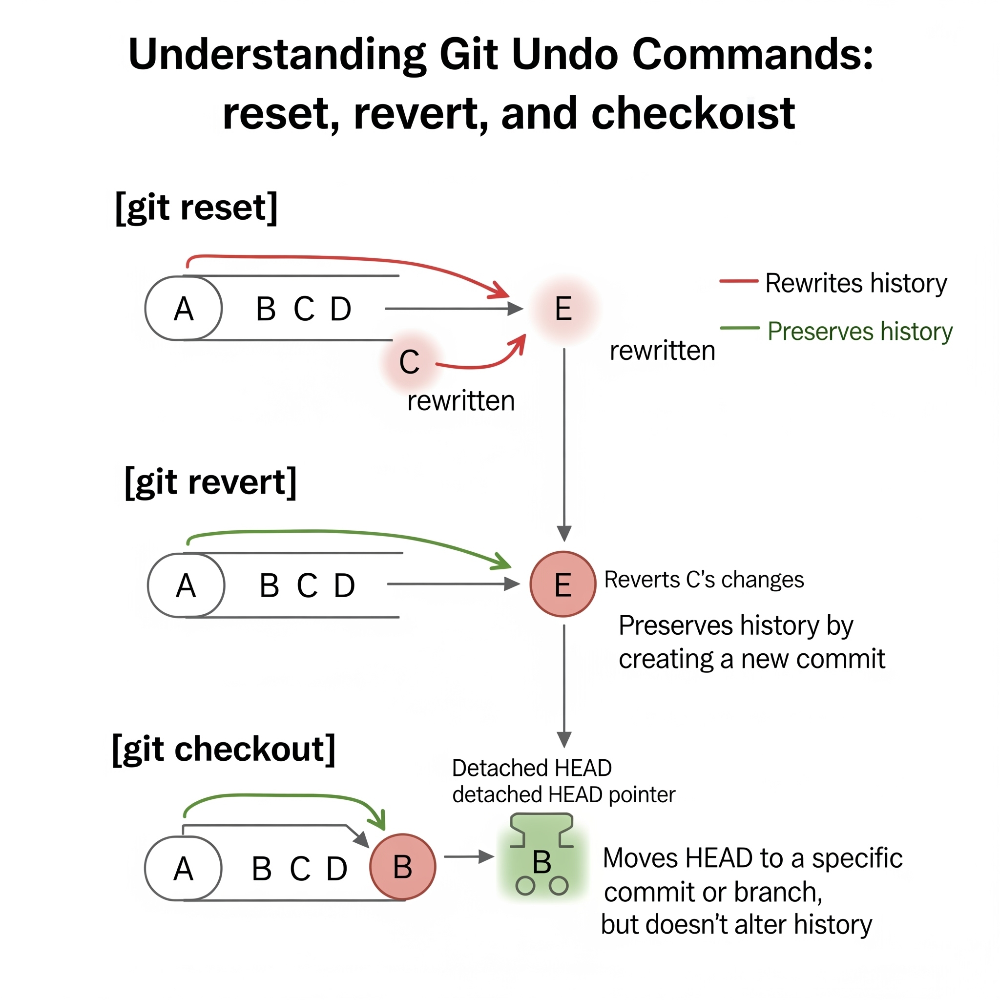
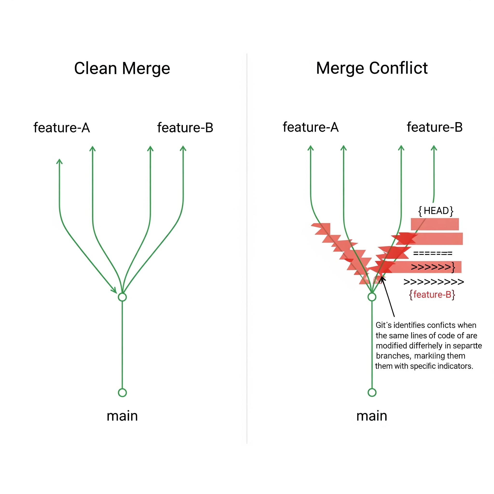
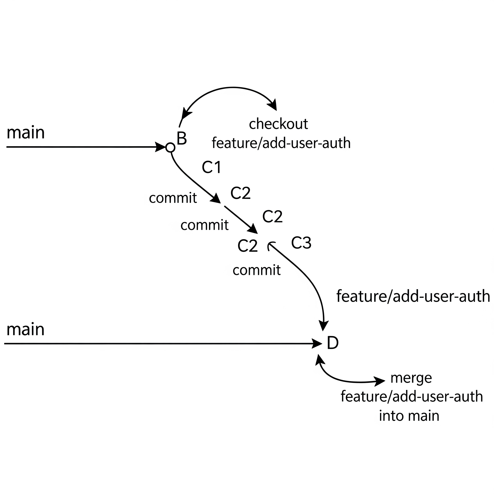

# 📘 Module 2: Using Git Locally — Learnings

This module focuses on how to use Git on your local machine for tracking, staging, committing, and managing files before interacting with remote repositories like GitHub. Below are detailed learnings and visual references to help reinforce each topic.

---

## 🧠 1. Git Local vs Remote

When using Git locally, all operations like committing, checking logs, and staging changes happen on your computer. Remote Git workflows involve collaborating using platforms like GitHub.

📍 **Visual Reference:**  


This diagram shows how local workflows differ from remote ones. Notice how commits are local, while pull/push sync with a remote repo.

---

## 🔁 2. Skipping the Staging Area

Normally, Git uses a staging area where you collect changes before committing. However, you can skip this using:

```bash 
git commit -a -m "Quick commit skipping staging"
```

This command adds and commits all modified (not new) tracked files in one step.

📍 **Visual Reference:**  


The image compares standard vs direct commit workflows.

---

## 🔍 3. Getting More Information About Changes

Git provides multiple commands to inspect your project’s state:

- `git status` — shows modified and staged files  
- `git diff` — shows line-by-line changes not yet staged  
- `git log` — shows commit history  

📍 **Visual Reference:**  


This split terminal view helps understand the role of each inspection tool.

---

## 🗑️ 4. Deleting and Renaming Files in Git

You can delete or rename files in Git while preserving version history using:

```bash git rm filename
  
bash `git mv oldname newname
```

📍 **Visual Reference:**  


Manual deletion bypasses Git’s tracking and requires `git add` or `git rm` afterward. The image shows a comparison of approaches.

---

## 🧩 5. Undoing Changes in Git

Common ways to undo changes **before committing**:

-  `git restore <file>` — undo changes in the working directory  
-  `git reset <file>` — unstage a file  
-  `git checkout -- <file>` — legacy way to discard changes  

📍 **Visual Reference:**  


The diagram illustrates undoing changes at different Git stages.

---

## ⏪ 6. Rollbacks: Reset, Revert, and Checkout

Sometimes you need to undo a commit or go back to a previous state. There are different methods:

- `git reset` — moves the HEAD pointer, can discard commits  
- `git revert` — creates a new commit that undoes a previous one  
- `git checkout` — switch to a different commit or branch  

📍 **Visual Reference:**  


This chart explains which rollback options are safe for public history.

---

## 🌿 7. Git Merge and Handling Conflicts

To combine branches:

```bash 
git checkout main 
git merge feature-branch
```
Conflicts occur when the same part of a file was changed in both branches. Git will notify you and mark the conflict sections in the file.

📍 **Visual Reference:**  


The image shows both a clean merge and a conflict example with resolution hints.

---

## 🌱 8. Branching and Merging Flow

A common Git flow:

1. Create a new branch:  `git checkout -b feature-branch`  
2. Make changes and commit  
3. Merge back:  `git checkout main` and `git merge feature-branch`

📍 **Visual Reference:**  


This flowchart outlines the entire branching and merging lifecycle.

---

## ✅ Summary

By the end of Module 2, you should understand how to:

- Work with Git completely offline  
- Use the staging area (or skip it)  
- Inspect your changes at various levels  
- Rename/delete files safely with Git  
- Undo mistakes gracefully  
- Merge branches and resolve conflicts  

Use the visuals in the `images/` folder to revisit these concepts whenever needed. They complement the terminal commands and reinforce core Git workflows. 🚀

---

> _This summary was prepared by Dheraj_k based on interaction with AI assistance and content from Google’s Coursera course._
